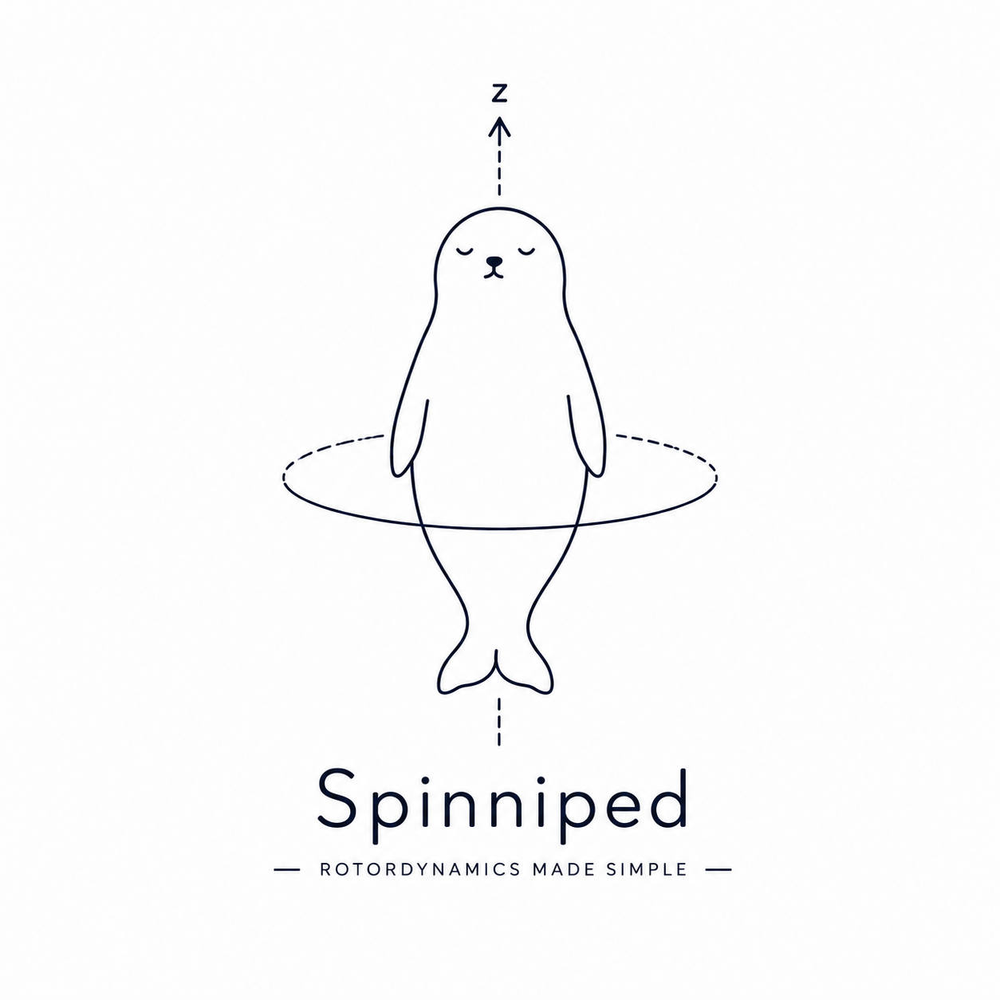

# Spinniped

<p align="center">
  
</p>

A minimal rotor/shaft finite-element toolbox for modal analysis, but with less dependecies as possible.

## Overview

This small package provides simple classes and helpers to build rotor models, assemble global matrices, solve eigenproblems, and plot mode shapes.

Core modules:

- `spinniped.element` — shaft element stiffness/mass.
- `spinniped.node` — node representation with 3D coordinates.
- `spinniped.rotor` — rotor assembly, node/element management and plotting.
- `spinniped.solver` — global assembly, boundary conditions, eigen-solver.
- `spinniped.results` — plotting utilities for mode shapes.

## Requirements

- Python 3.13
- NumPy
- SciPy
- Matplotlib

Install with pip:

```bash
python -m pip install numpy scipy matplotlib
```

If you prefer a single requirements file, create one with the packages above.

## Quick Usage

You can run the provided example script to try the library:

```bash
python examples/01_simple_shaft_modal.py
```

## Conventions

- Degrees of freedom (DOFs): the project uses 6 DOFs per node by default. Element DOF ordering typically follows `[x0, y0, z0, tx0, ty0, tz0, x1, y1, z1, tx1, ty1, tz1]`.
- Stiffness and mass matrix shapes are documented in the function docstrings in the source files.

## Examples and Benchmarks

- Example scripts: `examples/01_simple_shaft_modal.py` — a runnable demo of modal analysis.
- Benchmarks: `benchmark/01_beam_freq.py` contains analytical references for verification.

## Notes & To-Do


## Contributing

Feel free to open pull requests or issues. For quick testing, run the example scripts and verify plots render.
My goal is to keep the dependecies at minimal level. When adding features, do not add dependecies unless they are strictly ncessary. Numpy, Scipy and Matplotlib are probably enuough for any purpose for which this package was created.

---
