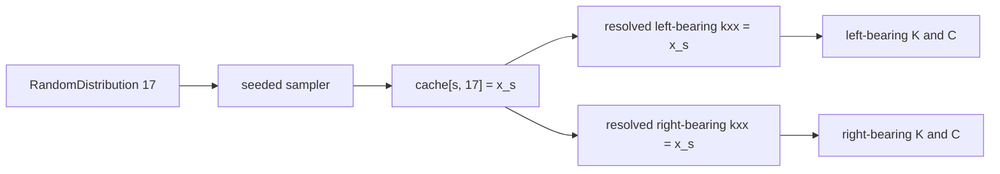

# Chapter 6 -- Random distributions

## Table of contents

- [Distribution records](#distribution-records)
- [Implemented families](#implemented-families)
- [Sampling and reuse](#sampling-and-reuse)

## Distribution records

`RandomDistribution` is a frozen, slotted record containing a unique integer
`id`, a unique nonempty `name`, a family name, and a strict parameter
dictionary. Numeric record fields use `(distribution_id,)` for a scalar or
`(distribution_id, component_index)` for one multivariate component.

## Implemented families

| Family | Required parameters | Deterministic resolution |
|---|---|---|
| `normal` | `mean`, `stdv` | mean |
| `uniform` | `low`, `high` | interval midpoint |
| `multivariate_normal` | `mean`, `stdv`, `correlation` | mean vector |

The builder rejects unexpected keys, nonfinite values, negative standard
deviations, reversed uniform bounds, and invalid correlation matrices.
Correlation matrices must be square, symmetric, positive semidefinite, and
have a unit diagonal.

## Sampling and reuse

`ModelBuilder` samples every registered distribution once per realization and
then replaces all references from that sample cache. Repeated references
therefore reuse exactly the same draw. A seeded NumPy generator supplies both
scalar and multivariate draws. Invalid resolved physical values identify the
sample and field path rather than being clipped or resampled.

The cache key contains both the realization index and distribution ID.
Reference resolution happens before element matrices are evaluated, which is
why all consumers of one reference are coherent within that realization.
