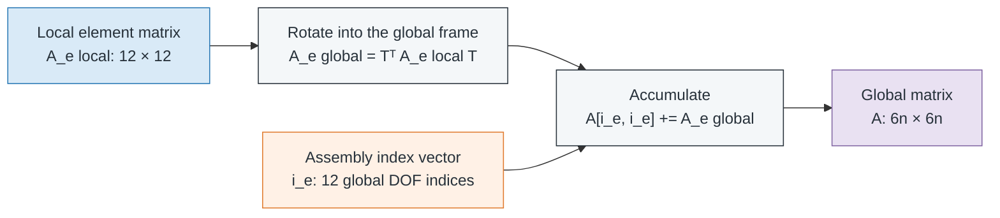
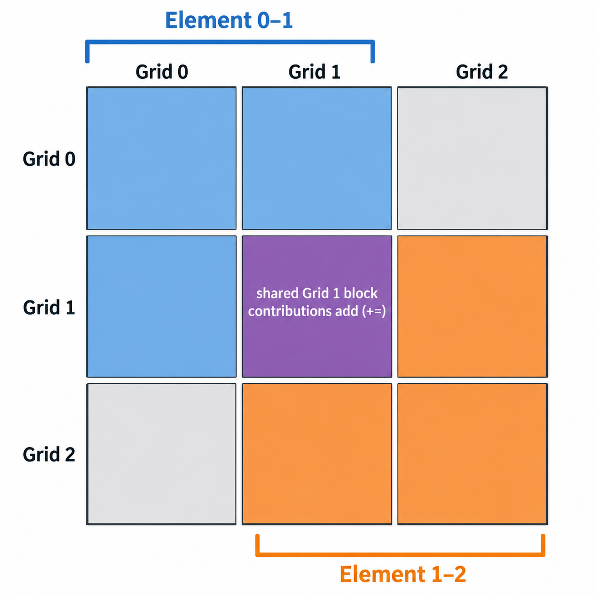

# Chapter 7 -- Model builder and assembly

## Table of contents

- [Transformation and global assembly](#transformation-and-global-assembly)
- [BuiltModel storage](#builtmodel-storage)

## Transformation and global assembly

Let the model contain $n$ compact grids. The global number of mechanical
degrees of freedom is

$$
n_\mathrm{dof}=6n,
$$

and each assembled matrix belongs to

$$
\mathbf{K},\mathbf{M},\mathbf{C},\mathbf{G}
\in\mathbb{R}^{6n\times 6n}.
$$

For an element connecting compact grid indices $p$ and $q$, the global index
vector is

$$
\mathbf{i}_e=
\begin{bmatrix}
6p & 6p+1 & 6p+2 & 6p+3 & 6p+4 & 6p+5 &
6q & 6q+1 & 6q+2 & 6q+3 & 6q+4 & 6q+5
\end{bmatrix}.
$$

Let $\mathbf{R}$ map global vector components to element-local components. The
12-DOF transformation is block diagonal:

$$
\mathbf{T}=\mathop{\text{diag}}(\mathbf{R},\mathbf{R},
\mathbf{R},\mathbf{R}),
\qquad
\mathbf{q}_e^{\mathrm{local}}=\mathbf{T}\mathbf{q}_e^{\mathrm{global}}.
$$

For each local matrix $\mathbf{A}_e\in
\{\mathbf{K}_e,\mathbf{M}_e,\mathbf{C}_e,\mathbf{G}_e\}$, the global-frame
element matrix is

$$
\mathbf{A}_e^{\mathrm{global}}=
\mathbf{T}^{T}\mathbf{A}_e^{\mathrm{local}}\mathbf{T}.
$$

It is accumulated according to

$$
A_{i_e(a),i_e(b)}\mathrel{+}=
A_{e,ab}^{\mathrm{global}},
\qquad a,b=0,1,\ldots,11.
$$



*The transformation and index map are separate operations: first rotate the
element matrix, then add its entries at the mapped global indices.*

<p align="center">
  
</p>

*Each square represents one 6-by-6 grid-to-grid block. Element 0–1 contributes
the blue upper-left footprint and element 1–2 the orange lower-right footprint.
Their contributions overlap in the purple grid-1 block, where assembly adds
both values instead of replacing either one.*

The builder performs this operation independently for every resolved
realization:

```text
for each resolved definition s:
    convert grid coordinates to the global frame
    allocate dense K[s], M[s], C[s], G[s]

    for each ShaftElement record:
        look up its ShaftProperty and Material records
        derive length and the local-to-global transformation
        evaluate shaft_stiffness, shaft_mass,
                 shaft_damping, and shaft_gyroscopic
        transform and add all four local matrices

    add each BearingElement and DiskElement nodal contribution
```

The final arrays have shape `(samples, ndof, ndof)`. The current builder uses
dense assembly; sparse global storage is not yet implemented.

## BuiltModel storage

`BuiltModel` is a frozen, slotted dataclass containing stiffness, mass, damping,
and unit-speed gyroscopic arrays with shape
`(samples, ndof, ndof)`. It also stores resolved coordinates, definitions,
grid-ID order, the stochastic flag, and seed. Its post-initialization checks
enforce common square shapes, six DOFs per grid, finite values, unique grid
IDs, and one resolved definition per sample.
