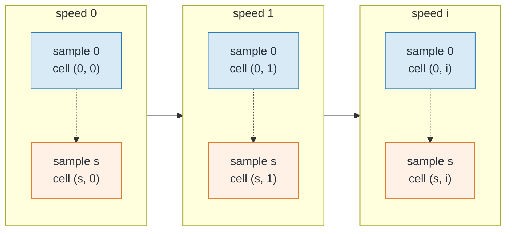

# Chapter 8 -- Solvers

## Table of contents

- [Equation and matrix convention](#equation-and-matrix-convention)
- [Mode correspondence](#mode-correspondence)
  - [MAC matrix and one-to-one assignment](#mac-matrix-and-one-to-one-assignment)
  - [Tracking as array-column placement](#tracking-as-array-column-placement)
  - [Reference modes used by each analysis](#reference-modes-used-by-each-analysis)
  - [Phase alignment and limitations](#phase-alignment-and-limitations)
- [Implemented analysis routes](#implemented-analysis-routes)
- [Critical-speed detection](#critical-speed-detection)
- [Validation and result invariants](#validation-and-result-invariants)

## Equation and matrix convention

Element matrices carry the subscript $e$:

$$
\mathbf{M}_e,\quad \mathbf{C}_e,\quad
\mathbf{G}_e,\quad \mathbf{K}_e.
$$

Their global assembled counterparts omit the subscript:

$$
\mathbf{M},\quad \mathbf{C},\quad
\mathbf{G},\quad \mathbf{K}.
$$

For realization $s$, Spinniped uses the second-order rotor equation

$$
\mathbf{M}^{(s)}\ddot{\mathbf{q}}^{(s)}+
\left(\mathbf{C}^{(s)}+\Omega\mathbf{G}^{(s)}\right)
\dot{\mathbf{q}}^{(s)}+
\mathbf{K}^{(s)}\mathbf{q}^{(s)}=
\mathbf{f}^{(s)}.
$$

The builder stores a global unit-speed gyroscopic matrix after applying each
element's spin-axis projection. The solver supplies the scalar factor $\Omega$
in rad/s for speed-dependent analyses.

For the undamped real modal analysis, the solved problem is

$$
\mathbf{K}^{(s)}\boldsymbol{\phi}^{(s)}=
\lambda^{(s)}\mathbf{M}^{(s)}\boldsymbol{\phi}^{(s)},
\qquad
f^{(s)}=\frac{\sqrt{\lambda^{(s)}}}{2\pi}.
$$

## Mode correspondence

Eigenvalue order alone is not a reliable physical mode label across stochastic
samples or through a Campbell speed sweep. With `track_modes=True`, Spinniped
compares mode shapes rather than assuming that the $j$th frequency remains the
same physical mode.

### MAC matrix and one-to-one assignment

Let the columns of $\boldsymbol{\Phi}_r\in\mathbb{C}^{n\times m_r}$ be the
reference modes and the columns of
$\boldsymbol{\Phi}_c\in\mathbb{C}^{n\times m_c}$ the newly calculated
candidate modes. Spinniped evaluates every reference-candidate pair:

$$
\mathop{\text{MAC}}_{ij}=
\frac{\left|\boldsymbol{\phi}_{r,i}^{H}
\boldsymbol{\phi}_{c,j}\right|^2}
{\left(\boldsymbol{\phi}_{r,i}^{H}\boldsymbol{\phi}_{r,i}\right)
 \left(\boldsymbol{\phi}_{c,j}^{H}\boldsymbol{\phi}_{c,j}\right)}.
$$

The superscript $H$ is the conjugate transpose, so the same expression is valid
for real and complex modes and is invariant to arbitrary eigenvector scale and
global complex phase. The implementation uses the ordinary unweighted
Hermitian inner product on the reduced vectors. A zero-norm pair receives a
zero score.

The complete MAC matrix has shape `(reference_modes, candidate_modes)`.
Spinniped applies a linear-sum assignment to `-MAC`, thereby choosing one
different candidate for every reference while maximizing the sum of the
selected MAC values. This is not an independent row-by-row maximum: two
reference modes cannot claim the same candidate. At least as many candidate
modes as reference modes must be available.

### Tracking as array-column placement

Suppose three reference columns are stored as
$[r_0,r_1,r_2]$, while the eigensolver returns candidates
$[c_0,c_1,c_2]$. If the assignment finds

$$
r_0\leftrightarrow c_2,
\qquad
r_1\leftrightarrow c_0,
\qquad
r_2\leftrightarrow c_1,
$$

the permutation is `mode_order = [2, 0, 1]`. Spinniped applies it to both
members of every eigenpair:

```python
tracked_eigenvalues = candidate_eigenvalues[mode_order]
tracked_eigenvectors = candidate_eigenvectors[:, mode_order]
```

The resulting storage is therefore:

| Destination mode position | Candidate placed there | Meaning |
|---:|---:|---|
| `0` | `2` | candidate matched to reference branch 0 |
| `1` | `0` | candidate matched to reference branch 1 |
| `2` | `1` | candidate matched to reference branch 2 |

Mode position is thus the tracked label. In a modal result,
`frequencies[s, j]`, `eigenvalues[s, j]`, and
`eigenvectors[s, :, j]` contain the mode assigned to sample-0 position `j`.
In a Campbell result,
`frequencies[s, i, j]`, `eigenvalues[s, i, j]`, and
`eigenvectors[s, i, :, j]` all describe the branch assigned to position `j`
for realization `s` and speed position `i`. Critical-speed arrays retain that
same mode position. Without tracking, position `j` merely means the $j$th
frequency-sorted root at that individual eigensolution.

### Reference modes used by each analysis

Modal tracking proceeds as follows:

1. Sample 0 is sorted by ascending eigenvalue after rigid modes are removed.
   If `modes=m` is supplied, its first `m` columns define tracked positions
   `0` through `m-1`.
2. Every later stochastic sample is compared directly with sample 0.
3. The selected candidate eigenpairs are permuted into the sample-0 positions.

Campbell tracking proceeds as follows:

1. At the first speed of each realization, positive-imaginary roots are sorted
   by frequency; the requested lowest modes establish the initial positions.
2. At every later speed, all current candidates are compared with the already
   tracked modes at the immediately preceding speed of the same realization.
   The displacement half of each complex state eigenvector is used to form the
   MAC matrix, and the complete state eigenpair is then placed into the matched
   position.
3. After this speedwise pass, every stochastic realization after sample 0 is
   matched once more to sample 0 at each speed. This gives mode position `j`
   the same sample-to-sample meaning as well as the same speedwise meaning.



*The Campbell result is organized as a two-dimensional grid: samples occupy the
rows and speeds occupy the columns; each cell contains the mode vector indexed
by `j`. Solid arrows between speed columns represent the first pass, which
tracks modes across speeds independently in every sample. Dashed vertical
arrows represent the second pass, which aligns each sample with sample 0 at the
same speed. Every match is implemented by assignment, column reordering, and
phase alignment. A
deterministic Campbell analysis contains only the first row. Stochastic modal
analysis is the same grid reduced to one speed column.*

Tracking therefore changes array order; it does not alter an eigenvalue or
blend two eigenvectors. The first solution still defines the branch labels. At
an exactly repeated eigenvalue, its individual eigenvectors are not unique, so
the initial labels inside that degenerate subspace can be arbitrary.

### Phase alignment and limitations

After the permutation, the relative complex phase of candidate column $j$ is
removed. With

$$
h_j=\boldsymbol{\phi}_{r,j}^{H}\boldsymbol{\phi}_{c,j},
$$

Spinniped multiplies the candidate by
$\overline{h_j}/|h_j|$, making its overlap with the reference real and
nonnegative. For real modes this reduces to sign alignment. MAC itself does
not require this step, but phase alignment prevents arbitrary sign or phase
flips in the eigenvectors stored in adjacent array positions. Campbell
assignment uses displacement components, whereas phase alignment is applied
to the full state vector.

Pairwise MAC can become ambiguous for repeated or nearly degenerate modes,
abruptly changing shapes, or a speed sequence too coarse to keep adjacent
solutions similar. In those cases the eigenspace may remain continuous even
though individual vectors rotate within it; subspace tracking would be more
appropriate. Spinniped currently performs pairwise MAC assignment and does not
refine the user's speed sequence automatically.

Mode counts must be consistent. The solver raises rather than returning ragged
object arrays when a requested count is unavailable or result shapes differ.


*Color identifies the independently sorted array column: column 0 is blue and
column 1 is orange. Marker geometry identifies physical shape: A uses circles
and B uses squares. Frequency sorting swaps the marker shapes between colored
columns at the crossing, whereas MAC correspondence follows each physical
shape through it.*

## Implemented analysis routes

`Solver.solve` dispatches to modal, Campbell, frequency-response, and
time-response implementations. Fixed global DOFs are validated, deduplicated,
and removed before solution.

The modal route evaluates the real undamped generalized eigenproblem and
requires symmetric stiffness and mass matrices. The Campbell route forms a
first-order damped gyroscopic state matrix at each requested speed. Frequency
response solves the complex dynamic-stiffness system. Time response integrates
the equivalent first-order system with SciPy.

## Critical-speed detection

Campbell analysis optionally accepts positive, unique `harmonics`. For sample
$s$, tracked mode $m$, and ratio $r$, the implementation evaluates the
residual at each sampled speed

$$
g_{s,m,r}(\Omega_i)=
f_{s,m}(\Omega_i)-\frac{r\Omega_i}{2\pi}.
$$

An exact zero stores $\Omega_i$. Opposite signs at adjacent sampled speeds
store the zero of the line joining their two residuals. No eigensolution is
performed between sampled speeds and no adaptive refinement exists. Detection
is therefore enabled only for strictly increasing speed sequences containing
at least two values and for `track_modes=True`.

All crossings are retained in ascending supplied-speed order. The numerical
result uses the shape `(samples, harmonics, modes, maximum_crossings)` and pads
missing entries with `NaN`; an integer `(samples, harmonics, modes)` array
stores the actual counts. This keeps results rectangular while preserving
stochastic sample and mode correspondence.

## Validation and result invariants

Mode counts are strict. Solver inputs must be finite and have documented
shapes; unknown options are rejected. Result arrays keep leading sample axes
and never use ragged object arrays. Modal and Campbell mode correspondence uses
MAC-based assignment and sign or phase alignment as described above.
