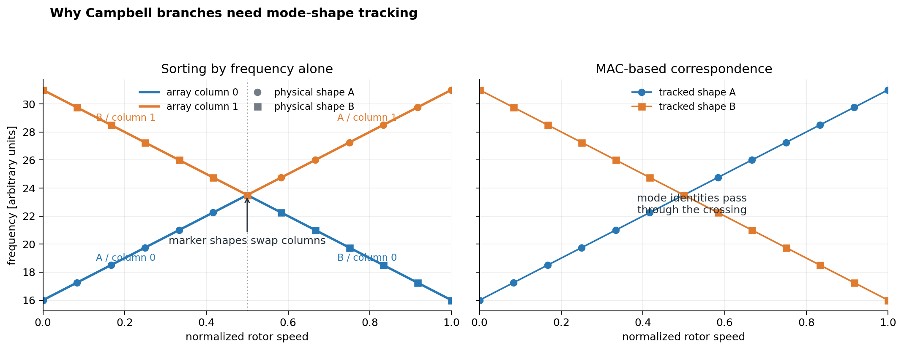

# Chapter 8 -- Solvers

## Table of contents

- [Equation and matrix convention](#equation-and-matrix-convention)
- [Mode correspondence](#mode-correspondence)
- [Implemented analysis routes](#implemented-analysis-routes)
- [Critical-speed detection](#critical-speed-detection)
- [Validation and result invariants](#validation-and-result-invariants)

## Equation and matrix convention

Element matrices carry the subscript $e$:

$$
\mathbf{M}_e,\quad \mathbf{C}_e,\quad
\mathbf{G}_e,\quad \mathbf{K}_e.
$$

Their global assembled counterparts omit the subscript:

$$
\mathbf{M},\quad \mathbf{C},\quad
\mathbf{G},\quad \mathbf{K}.
$$

For realization $s$, Spinniped uses the second-order rotor equation

$$
\mathbf{M}^{(s)}\ddot{\mathbf{q}}^{(s)}+
\left(\mathbf{C}^{(s)}+\Omega\mathbf{G}^{(s)}\right)
\dot{\mathbf{q}}^{(s)}+
\mathbf{K}^{(s)}\mathbf{q}^{(s)}=
\mathbf{f}^{(s)}.
$$

The builder stores a global unit-speed gyroscopic matrix after applying each
element's spin-axis projection. The solver supplies the scalar factor $\Omega$
in rad/s for speed-dependent analyses.

For the undamped real modal analysis, the solved problem is

$$
\mathbf{K}^{(s)}\boldsymbol{\phi}^{(s)}=
\lambda^{(s)}\mathbf{M}^{(s)}\boldsymbol{\phi}^{(s)},
\qquad
f^{(s)}=\frac{\sqrt{\lambda^{(s)}}}{2\pi}.
$$

## Mode correspondence

Eigenvalue order alone is not a reliable physical mode label across stochastic
samples or through a Campbell speed sweep. With `track_modes=True`, Spinniped
uses the Modal Assurance Criterion between a reference vector
$\boldsymbol{\phi}_r$ and candidate $\boldsymbol{\phi}_c$:

$$
\mathop{\text{MAC}}(\boldsymbol{\phi}_r,\boldsymbol{\phi}_c)=
\frac{\left|\boldsymbol{\phi}_r^H\boldsymbol{\phi}_c\right|^2}
{\left(\boldsymbol{\phi}_r^H\boldsymbol{\phi}_r\right)
 \left(\boldsymbol{\phi}_c^H\boldsymbol{\phi}_c\right)}.
$$

A one-to-one assignment maximizes total MAC. Modal samples are matched to
sample zero. Campbell modes are matched first between consecutive speeds, then
between each stochastic sample and sample zero at the same speed. After
assignment, each candidate is multiplied by a sign or complex phase factor so
its overlap with the reference is real and nonnegative. All comparisons use
the reduced free-DOF vectors; Campbell matching uses the displacement half of
the state eigenvector.

Mode counts must be consistent. The solver raises rather than returning ragged
object arrays when a requested count is unavailable or result shapes differ.

*Color identifies the independently sorted array column: column 0 is blue and
column 1 is orange. Marker geometry identifies physical shape: A uses circles
and B uses squares. Frequency sorting swaps the marker shapes between colored
columns at the crossing, whereas MAC correspondence follows each physical
shape through it.*

## Implemented analysis routes

`Solver.solve` dispatches to modal, Campbell, frequency-response, and
time-response implementations. Fixed global DOFs are validated, deduplicated,
and removed before solution.

The modal route evaluates the real undamped generalized eigenproblem and
requires symmetric stiffness and mass matrices. The Campbell route forms a
first-order damped gyroscopic state matrix at each requested speed. Frequency
response solves the complex dynamic-stiffness system. Time response integrates
the equivalent first-order system with SciPy.

## Critical-speed detection

Campbell analysis optionally accepts positive, unique `harmonics`. For sample
$s$, tracked mode $m$, and ratio $r$, the implementation evaluates the
residual at each sampled speed

$$
g_{s,m,r}(\Omega_i)=
f_{s,m}(\Omega_i)-\frac{r\Omega_i}{2\pi}.
$$

An exact zero stores $\Omega_i$. Opposite signs at adjacent sampled speeds
store the zero of the line joining their two residuals. No eigensolution is
performed between sampled speeds and no adaptive refinement exists. Detection
is therefore enabled only for strictly increasing speed sequences containing
at least two values and for `track_modes=True`.

All crossings are retained in ascending supplied-speed order. The numerical
result uses the shape `(samples, harmonics, modes, maximum_crossings)` and pads
missing entries with `NaN`; an integer `(samples, harmonics, modes)` array
stores the actual counts. This keeps results rectangular while preserving
stochastic sample and mode correspondence.

## Validation and result invariants

Mode counts are strict. Solver inputs must be finite and have documented
shapes; unknown options are rejected. Result arrays keep leading sample axes
and never use ragged object arrays. Modal and Campbell mode correspondence uses
MAC-based assignment and sign or phase alignment as described above.
