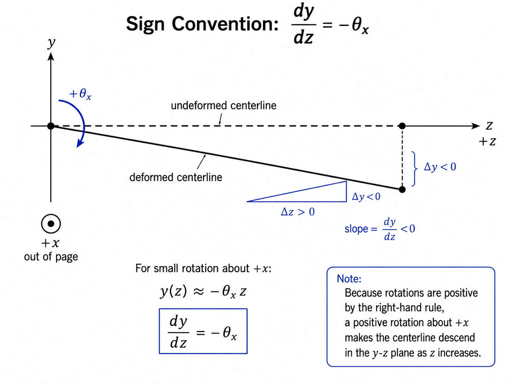

# Chapter 9 -- Shaft-element formulation

## Table of contents

- [1. Element degree-of-freedom vector](#1-element-degree-of-freedom-vector)
- [2. Geometric and material quantities](#2-geometric-and-material-quantities)
- [3. Element stiffness matrix structure](#3-element-stiffness-matrix-structure)
- [4. Axial stiffness matrix](#4-axial-stiffness-matrix)
- [5. Torsional stiffness matrix](#5-torsional-stiffness-matrix)
- [6. Timoshenko bending stiffness matrices](#6-timoshenko-bending-stiffness-matrices)
- [7. Euler-Bernoulli bending stiffness matrices](#7-euler-bernoulli-bending-stiffness-matrices)
- [8. Element mass matrix structure](#8-element-mass-matrix-structure)
- [9. Axial mass matrix](#9-axial-mass-matrix)
- [10. Torsional inertia matrix](#10-torsional-inertia-matrix)
- [11. Euler-Bernoulli translational bending mass matrices](#11-euler-bernoulli-translational-bending-mass-matrices)
- [12. Timoshenko translational bending mass matrices](#12-timoshenko-translational-bending-mass-matrices)
- [13. Euler-Bernoulli rotary inertia contribution](#13-euler-bernoulli-rotary-inertia-contribution)
- [14. Timoshenko rotary inertia contribution](#14-timoshenko-rotary-inertia-contribution)
- [15. Unit-speed gyroscopic matrix](#15-unit-speed-gyroscopic-matrix)
- [16. Shaft damping matrix](#16-shaft-damping-matrix)

This manual chapter documents the two-grid shaft formulation evaluated by
`spinniped.stiffness.shaft_stiffness`, `spinniped.mass.shaft_mass`,
`spinniped.damping.shaft_damping`, and
`spinniped.gyroscopic.shaft_gyroscopic`. `ShaftElement` is the declarative
connectivity record; it does not store numerical matrices.

For a derivation-led introduction that begins with free-body diagrams rather
than finite-element matrices, see the
[rotordynamics theory manual](../theory-manual/00_theory_manual.md).

## 1. Element degree-of-freedom vector

For a two-grid shaft element connecting local ends 0 and 1:

$$
\mathbf{q}_e =
\begin{bmatrix}
 x_0 & y_0 & z_0 & \theta_{x_0} & \theta_{y_0} & \theta_{z_0} &
 x_1 & y_1 & z_1 & \theta_{x_1} & \theta_{y_1} & \theta_{z_1}
\end{bmatrix}^T
$$

The local zero-based index map is:

| Local index | DOF |
|---:|---|
| 0 | $x_0$ |
| 1 | $y_0$ |
| 2 | $z_0$ |
| 3 | $\theta_{x_0}$ |
| 4 | $\theta_{y_0}$ |
| 5 | $\theta_{z_0}$ |
| 6 | $x_1$ |
| 7 | $y_1$ |
| 8 | $z_1$ |
| 9 | $\theta_{x_1}$ |
| 10 | $\theta_{y_1}$ |
| 11 | $\theta_{z_1}$ |

The element matrix blocks are inserted through the following local index sets:

| Physical contribution | Local DOF subset | Python indices |
|---|---|---:|
| Axial deformation along $z$ | $[z_0, z_1]$ | `[2, 8]` |
| Torsion about $z$ | $[\theta_{z_0}, \theta_{z_1}]$ | `[5, 11]` |
| Bending in the $x$-$z$ plane | $[x_0, \theta_{y_0}, x_1, \theta_{y_1}]$ | `[0, 4, 6, 10]` |
| Bending in the $y$-$z$ plane | $[y_0, \theta_{x_0}, y_1, \theta_{x_1}]$ | `[1, 3, 7, 9]` |

The bending sign convention used in the code is:

$$
\frac{dx}{dz} = \theta_y,
\qquad
\frac{dy}{dz} = -\theta_x
$$

This explains why the $x$-$z$ and $y$-$z$ bending matrices have the same physical content but different signs in the displacement-rotation coupling terms.

  

---

## 2. Geometric and material quantities

For a circular annular shaft with outer diameter $d_o$, inner diameter $d_i$,
and element length $L$:

$$
A = \frac{\pi (d_o^2-d_i^2)}{4}
$$

$$
I = I_x = I_y = \frac{\pi (d_o^4-d_i^4)}{64}
$$

$$
J = I_p = \frac{\pi (d_o^4-d_i^4)}{32}=2I
$$

Setting $d_i=0$ gives a solid shaft. In this document, $J$ is the
**geometric polar second moment of area**, not a lumped mass moment of inertia.
The torsional mass and gyroscopic terms use $\rho J$ as the distributed polar
mass moment per unit length.

The shear modulus is:

$$
G = \frac{E}{2(1+\nu)}
$$

The shear correction factor used by the implementation is:

$$
\kappa = \frac{6(1+\nu)}{7+6\nu}
$$

The Timoshenko shear parameter is:

$$
\phi = \frac{12EI}{\kappa G A L^2}
$$

When $\phi \to 0$, the bending stiffness terms reduce to the Euler-Bernoulli stiffness terms.

---

## 3. Element stiffness matrix structure

The complete element stiffness matrix is a $12 \times 12$ matrix:

$$
\mathbf{K}_e \in \mathbb{R}^{12 \times 12}
$$

It is assembled by inserting smaller axial, torsional, and bending matrices into the Spinniped local ordering:

$$
\mathbf{K}_e[i_a, i_a] = \mathbf{K}_{a}
$$

$$
\mathbf{K}_e[i_t, i_t] = \mathbf{K}_{t}
$$

$$
\mathbf{K}_e[i_{bx}, i_{bx}] = \mathbf{K}_{bx}
$$

$$
\mathbf{K}_e[i_{by}, i_{by}] = \mathbf{K}_{by}
$$

where:

$$
i_a = [2,8]
$$

$$
i_t = [5,11]
$$

$$
i_{bx} = [0,4,6,10]
$$

$$
i_{by} = [1,3,7,9]
$$

---

## 4. Axial stiffness matrix

The axial deformation is governed by the two degree-of-freedom vector:

$$
\mathbf{q}_a =
\begin{bmatrix}
 z_0 & z_1
\end{bmatrix}^T
$$

The axial stiffness matrix is:

$$
\mathbf{K}_a = \frac{EA}{L}
\begin{bmatrix}
 1 & -1 \\
 -1 & 1
\end{bmatrix}
$$

This matrix is identical for Timoshenko and Euler-Bernoulli beam theory because shear deformation affects bending, not axial extension.

---

## 5. Torsional stiffness matrix

The torsional deformation is governed by:

$$
\mathbf{q}_t =
\begin{bmatrix}
 \theta_{z_0} & \theta_{z_1}
\end{bmatrix}^T
$$

The torsional stiffness matrix is:

$$
\mathbf{K}_t = \frac{GJ}{L}
\begin{bmatrix}
 1 & -1 \\
 -1 & 1
\end{bmatrix}
$$

This matrix is identical for the Timoshenko and Euler-Bernoulli options.

---

## 6. Timoshenko bending stiffness matrices

Timoshenko beam theory includes both bending deformation and shear deformation.
The shear flexibility enters through $\phi$.
The scalar multiplier is:

$$
k_0 = \frac{EI}{L^3(1+\phi)}
$$

Define:

$$
k_1 = 12
$$

$$
k_2 = 6L
$$

$$
k_3 = (4+\phi)L^2
$$

$$
k_4 = (2-\phi)L^2
$$

### 6.1 Bending in the $x$-$z$ plane

The active bending vector is:

$$
\mathbf{q}_{bx} =
\begin{bmatrix}
 x_0 & \theta_{y_0} & x_1 & \theta_{y_1}
\end{bmatrix}^T
$$

The Timoshenko bending stiffness matrix in the $x$-$z$ plane is:

$$
\mathbf{K}_{bx}^{T} = k_0
\begin{bmatrix}
 k_1 & k_2 & -k_1 & k_2 \\
 k_2 & k_3 & -k_2 & k_4 \\
 -k_1 & -k_2 & k_1 & -k_2 \\
 k_2 & k_4 & -k_2 & k_3
\end{bmatrix}
$$

The superscript $T$ indicates Timoshenko, not transpose.

### 6.2 Bending in the $y$-$z$ plane

The active bending vector is:

$$
\mathbf{q}_{by} =
\begin{bmatrix}
 y_0 & \theta_{x_0} & y_1 & \theta_{x_1}
\end{bmatrix}^T
$$

Because $dy/dz = -\theta_x$, the displacement-rotation coupling signs differ from the $x$-$z$ plane:

$$
\mathbf{K}_{by}^{T} = k_0
\begin{bmatrix}
 k_1 & -k_2 & -k_1 & -k_2 \\
 -k_2 & k_3 & k_2 & k_4 \\
 -k_1 & k_2 & k_1 & k_2 \\
 -k_2 & k_4 & k_2 & k_3
\end{bmatrix}
$$

---

## 7. Euler-Bernoulli bending stiffness matrices

Euler-Bernoulli beam theory neglects shear deformation.
For the implemented matrix, this corresponds to setting $\phi = 0$ in the Timoshenko bending stiffness.
The scalar multiplier is:

$$
k_0 = \frac{EI}{L^3}
$$

Define:

$$
k_1 = 12
$$

$$
k_2 = 6L
$$

$$
k_3 = 4L^2
$$

$$
k_4 = 2L^2
$$

### 7.1 Bending in the $x$-$z$ plane

$$
\mathbf{K}_{bx}^{EB} = k_0
\begin{bmatrix}
 k_1 & k_2 & -k_1 & k_2 \\
 k_2 & k_3 & -k_2 & k_4 \\
 -k_1 & -k_2 & k_1 & -k_2 \\
 k_2 & k_4 & -k_2 & k_3
\end{bmatrix}
$$

### 7.2 Bending in the $y$-$z$ plane

$$
\mathbf{K}_{by}^{EB} = k_0
\begin{bmatrix}
 k_1 & -k_2 & -k_1 & -k_2 \\
 -k_2 & k_3 & k_2 & k_4 \\
 -k_1 & k_2 & k_1 & k_2 \\
 -k_2 & k_4 & k_2 & k_3
\end{bmatrix}
$$

Here $EB$ means Euler-Bernoulli.

---

## 8. Element mass matrix structure

The shaft mass matrix can be split into translational and rotary-inertia
contributions:

$$
\mathbf{M}_e = \mathbf{M}_{e,\mathrm{trans}} + \mathbf{M}_{e,\mathrm{rot}}
$$

`ShaftProperty.rotary_inertia` controls the second contribution:

$$
\mathbf{M}_e=
\begin{cases}
\mathbf{M}_{e,\mathrm{trans}}, & \text{if rotary inertia is disabled},\\
\mathbf{M}_{e,\mathrm{trans}}+\mathbf{M}_{e,\mathrm{rot}},
& \text{if rotary inertia is enabled}.
\end{cases}
$$

Rotary inertia is enabled by default. It becomes increasingly important for
higher-frequency modes, where rotational kinetic energy of the cross-section
is no longer negligible.

---

## 9. Axial mass matrix

The consistent axial mass matrix is:

$$
\mathbf{M}_a = \frac{\rho A L}{6}
\begin{bmatrix}
 2 & 1 \\
 1 & 2
\end{bmatrix}
$$

It is inserted into the local indices `[2, 8]`.

---

## 10. Torsional inertia matrix

The consistent torsional inertia matrix is:

$$
\mathbf{M}_t = \frac{\rho J L}{6}
\begin{bmatrix}
 2 & 1 \\
 1 & 2
\end{bmatrix}
$$

It is inserted into the local indices `[5, 11]`.

This torsional inertia is always retained because torsional modes require it.
`ShaftProperty.rotary_inertia` controls the additional bending rotary-inertia
contribution, not this block.

---

## 11. Euler-Bernoulli translational bending mass matrices

The Euler-Bernoulli translational bending mass multiplier is:

$$
m_0 = \frac{\rho A L}{420}
$$

Define:

$$
m_1 = 156
$$

$$
m_2 = 22L
$$

$$
m_3 = 54
$$

$$
m_4 = -13L
$$

$$
m_5 = 4L^2
$$

$$
m_6 = -3L^2
$$

### 11.1 Bending inertia in the $x$-$z$ plane

For:

$$
\mathbf{q}_{bx} =
\begin{bmatrix}
 x_0 & \theta_{y_0} & x_1 & \theta_{y_1}
\end{bmatrix}^T
$$

$$
\mathbf{M}_{bx,\mathrm{trans}}^{EB} = m_0
\begin{bmatrix}
 m_1 & m_2 & m_3 & m_4 \\
 m_2 & m_5 & -m_4 & m_6 \\
 m_3 & -m_4 & m_1 & -m_2 \\
 m_4 & m_6 & -m_2 & m_5
\end{bmatrix}
$$

Expanded:

$$
\mathbf{M}_{bx,\mathrm{trans}}^{EB} = \frac{\rho A L}{420}
\begin{bmatrix}
 156 & 22L & 54 & -13L \\
 22L & 4L^2 & 13L & -3L^2 \\
 54 & 13L & 156 & -22L \\
 -13L & -3L^2 & -22L & 4L^2
\end{bmatrix}
$$

### 11.2 Bending inertia in the $y$-$z$ plane

For:

$$
\mathbf{q}_{by} =
\begin{bmatrix}
 y_0 & \theta_{x_0} & y_1 & \theta_{x_1}
\end{bmatrix}^T
$$

$$
\mathbf{M}_{by,\mathrm{trans}}^{EB} = m_0
\begin{bmatrix}
 m_1 & -m_2 & m_3 & -m_4 \\
 -m_2 & m_5 & m_4 & m_6 \\
 m_3 & m_4 & m_1 & m_2 \\
 -m_4 & m_6 & m_2 & m_5
\end{bmatrix}
$$

Expanded:

$$
\mathbf{M}_{by,\mathrm{trans}}^{EB} = \frac{\rho A L}{420}
\begin{bmatrix}
 156 & -22L & 54 & 13L \\
 -22L & 4L^2 & -13L & -3L^2 \\
 54 & -13L & 156 & 22L \\
 13L & -3L^2 & 22L & 4L^2
\end{bmatrix}
$$

---

## 12. Timoshenko translational bending mass matrices

The Timoshenko translational bending mass matrix includes shear-flexibility terms through $\phi$.
The scalar multiplier is:

$$
m_0 = \frac{\rho A L}{840(1+\phi)^2}
$$

Define:

$$
m_1 = 312 + 588\phi + 280\phi^2
$$

$$
m_2 = (44 + 77\phi + 35\phi^2)L
$$

$$
m_3 = 108 + 252\phi + 140\phi^2
$$

$$
m_4 = -(26 + 63\phi + 35\phi^2)L
$$

$$
m_5 = (8 + 14\phi + 7\phi^2)L^2
$$

$$
m_6 = -(6 + 14\phi + 7\phi^2)L^2
$$

### 12.1 Bending inertia in the $x$-$z$ plane

$$
\mathbf{M}_{bx,\mathrm{trans}}^{T} = m_0
\begin{bmatrix}
 m_1 & m_2 & m_3 & m_4 \\
 m_2 & m_5 & -m_4 & m_6 \\
 m_3 & -m_4 & m_1 & -m_2 \\
 m_4 & m_6 & -m_2 & m_5
\end{bmatrix}
$$

### 12.2 Bending inertia in the $y$-$z$ plane

$$
\mathbf{M}_{by,\mathrm{trans}}^{T} = m_0
\begin{bmatrix}
 m_1 & -m_2 & m_3 & -m_4 \\
 -m_2 & m_5 & m_4 & m_6 \\
 m_3 & m_4 & m_1 & m_2 \\
 -m_4 & m_6 & m_2 & m_5
\end{bmatrix}
$$

If $\phi = 0$, these expressions reduce to the Euler-Bernoulli consistent translational bending mass matrix.

---

## 13. Euler-Bernoulli rotary inertia contribution

Strict Euler-Bernoulli beam theory neglects rotary inertia.
When rotary inertia is enabled with `theory="euler"`, the inertia model is
closer to a Rayleigh beam model than to strict Euler-Bernoulli theory.
The scalar multiplier is:

$$
r_0 = \frac{\rho I}{30L}
$$

Define:

$$
r_7 = 36
$$

$$
r_8 = 3L
$$

$$
r_9 = 4L^2
$$

$$
r_{10} = -L^2
$$

### 13.1 Rotary inertia in the $x$-$z$ bending plane

$$
\mathbf{M}_{bx,\mathrm{rot}}^{EB} = r_0
\begin{bmatrix}
 r_7 & r_8 & -r_7 & r_8 \\
 r_8 & r_9 & -r_8 & r_{10} \\
 -r_7 & -r_8 & r_7 & -r_8 \\
 r_8 & r_{10} & -r_8 & r_9
\end{bmatrix}
$$

### 13.2 Rotary inertia in the $y$-$z$ bending plane

$$
\mathbf{M}_{by,\mathrm{rot}}^{EB} = r_0
\begin{bmatrix}
 r_7 & -r_8 & -r_7 & -r_8 \\
 -r_8 & r_9 & r_8 & r_{10} \\
 -r_7 & r_8 & r_7 & r_8 \\
 -r_8 & r_{10} & r_8 & r_9
\end{bmatrix}
$$

---

## 14. Timoshenko rotary inertia contribution

The Timoshenko rotary inertia contribution uses the same bending DOF subsets but includes $\phi$.
The scalar multiplier is:

$$
r_0 = \frac{\rho I}{30L(1+\phi)^2}
$$

Define:

$$
r_7 = 36
$$

$$
r_8 = (3 - 15\phi)L
$$

$$
r_9 = (4 + 5\phi + 10\phi^2)L^2
$$

$$
r_{10} = (-1 - 5\phi + 5\phi^2)L^2
$$

### 14.1 Rotary inertia in the $x$-$z$ bending plane

$$
\mathbf{M}_{bx,\mathrm{rot}}^{T} = r_0
\begin{bmatrix}
 r_7 & r_8 & -r_7 & r_8 \\
 r_8 & r_9 & -r_8 & r_{10} \\
 -r_7 & -r_8 & r_7 & -r_8 \\
 r_8 & r_{10} & -r_8 & r_9
\end{bmatrix}
$$

### 14.2 Rotary inertia in the $y$-$z$ bending plane

$$
\mathbf{M}_{by,\mathrm{rot}}^{T} = r_0
\begin{bmatrix}
 r_7 & -r_8 & -r_7 & -r_8 \\
 -r_8 & r_9 & r_8 & r_{10} \\
 -r_7 & r_8 & r_7 & r_8 \\
 -r_8 & r_{10} & r_8 & r_9
\end{bmatrix}
$$

---

## 15. Unit-speed gyroscopic matrix

The distributed shaft polar inertia produces a skew-symmetric gyroscopic
matrix. Define the consistent two-grid inertia block

$$
\mathbf{H}=\frac{\rho J L}{6}
\begin{bmatrix}
2 & 1\\
1 & 2
\end{bmatrix}.
$$

Using the index lists

$$
i_{rx}=[3,9],
\qquad
i_{ry}=[4,10],
$$

the nonzero blocks are

$$
\mathbf{G}_e[i_{rx},i_{ry}]=\mathbf{H},
\qquad
\mathbf{G}_e[i_{ry},i_{rx}]=-\mathbf{H}.
$$

Therefore

$$
\mathbf{G}_e^T=-\mathbf{G}_e.
$$

`shaft_gyroscopic` returns this unit-speed matrix. The physical velocity term
used by speed-dependent solvers is $\Omega\mathbf{G}_e$.

## 16. Shaft damping matrix

The current shaft damping model is mass proportional. If
`ShaftProperty.damping` is the coefficient $\alpha$,

$$
\mathbf{C}_e=\alpha\mathbf{M}_e.
$$

In a coherent SI model, $\alpha$ has units of $\mathrm{s}^{-1}$.

The same rotary-inertia option used to construct $\mathbf{M}_e$ consequently
affects $\mathbf{C}_e$. Setting `damping=0.0`, the default, gives a zero shaft
damping matrix. This simple viscous model is not a general material-loss or
hysteretic-damping formulation.
