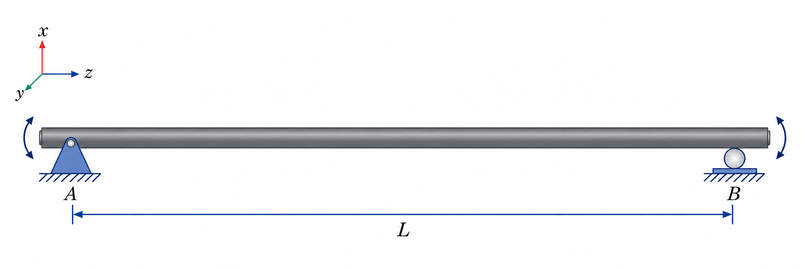
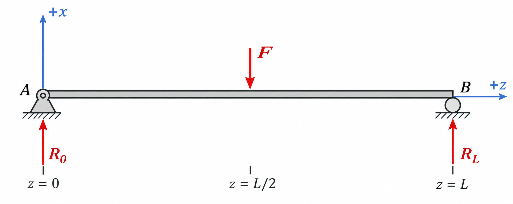

# Chapter 2 -- Stationary simply supported shaft

## Table of contents

- [Chapter content](#chapter-content)

## Chapter content

Before studying vibration, consider a uniform shaft at rest under a transverse
point force $F$ at its midpoint. A pin at $z=0$ and a roller at $z=L$ prevent
transverse displacement while allowing the end sections to rotate.

An idealized free-body diagram in the $x$-$z$ plane is

*Free-body diagram of the complete shaft. The pin at $A$ and roller at $B$
produce the transverse reactions $R_0$ and $R_L$; the applied force $F$ acts
at $z=L/2$.*

The whole-shaft force and moment balances are

$$
R_0+R_L-F=0,
$$

$$
R_L L-F\frac{L}{2}=0.
$$

Therefore

$$
R_0=R_L=\frac{F}{2}.
$$

Cutting the left half at coordinate $z$ gives its internal shear force and
bending moment:

$$
V(z)=\frac{F}{2},
\qquad
M(z)=\frac{Fz}{2},
\qquad 0<z<\frac{L}{2}.
$$

Symmetry gives the right half. The maximum bending moment is $FL/4$ at the
center. This elementary calculation already contains the core method: isolate
a body, expose the actions at the cut, and impose balance.

A *simply supported* condition concerns transverse bending. It does not by
itself specify axial or torsional restraint. In later chapters this guide uses
one fixed and one free end for the separate axial and torsional examples, and
two simple supports for bending. Those boundary conditions must not be mixed
silently.
