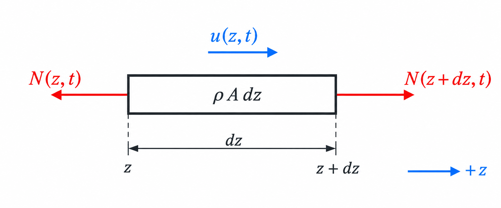

# Chapter 4 -- Axial vibration

## Table of contents

- [4.1 Assumptions and coordinate](#41-assumptions-and-coordinate)
- [4.2 Differential free body](#42-differential-free-body)
- [4.3 Separation of variables and boundary conditions](#43-separation-of-variables-and-boundary-conditions)

## 4.1 Assumptions and coordinate

Assume a straight, uniform, stationary shaft with small axial displacement
$u(z,t)$ along global $z$. Neglect damping and transverse motion. Let the left
end be fixed axially and the right end be force-free:

$$
u(0,t)=0,
\qquad
N(L,t)=0.
$$

## 4.2 Differential free body

Isolate a slice from $z$ to $z+\mathrm dz$:

*Axial differential element. Positive displacement $u(z,t)$ follows $+z$.
The internal forces on the two exposed faces point outward in positive
tension.*

Its mass is $\rho A\,\mathrm dz$. Axial force balance gives

$$
N(z+\mathrm dz,t)-N(z,t)
=\rho A\,\mathrm dz\,\frac{\partial^2u}{\partial t^2}.
$$

After division by $\mathrm dz$ and passage to the limit,

$$
\frac{\partial N}{\partial z}=\rho A\frac{\partial^2u}{\partial t^2}.
$$

Linear elasticity relates axial force to strain:

$$
N=EA\frac{\partial u}{\partial z}.
$$

For constant $E$ and $A$, substitution produces the axial wave equation:

$$
EA\frac{\partial^2u}{\partial z^2}
=\rho A\frac{\partial^2u}{\partial t^2},
$$

or

$$
\frac{\partial^2u}{\partial t^2}
=c_a^2\frac{\partial^2u}{\partial z^2},
\qquad
c_a=\sqrt{\frac{E}{\rho}}.
$$

## 4.3 Separation of variables and boundary conditions

The wave equation contains two independent variables: $z$ tells us *where* a
shaft section is, and $t$ tells us *when* it is observed. For a normal mode,
every section oscillates at the same frequency while the relative displacement
from one section to another remains fixed. This motivates the product

$$
u(z,t)=U(z)a(t),
$$

where $U(z)$ is the mode shape and $a(t)$ is its time-dependent amplitude.
This product does not assert that every possible motion contains only one
mode. Because the governing equation is linear, a general free response can
later be assembled by superposing separated modes.

Substitution into the wave equation gives

$$
U(z)\ddot a(t)=c_a^2U''(z)a(t).
$$

For a nonzero mode, divide by $c_a^2U(z)a(t)$:

$$
\frac{\ddot a(t)}{c_a^2a(t)}
=\frac{U''(z)}{U(z)}.
$$

The left side depends only on time and the right side only on position. They
can remain equal for every $z$ and $t$ only if both equal the same constant.
Write that constant as $-\beta^2$:

$$
\frac{U''}{U}
=\frac{\ddot a}{c_a^2a}
=-\beta^2.
$$

The negative sign is not an arbitrary trick. A zero constant gives only the
trivial shape for the present fixed--free boundary conditions. A positive
constant produces hyperbolic spatial functions, and those boundary conditions
again admit only the trivial shape. The negative constant produces the
nontrivial oscillatory modes.

The single partial differential equation has now become two ordinary
differential equations:

$$
U''+\beta^2U=0,
\qquad
\ddot a+\omega^2a=0,
\qquad
\omega=c_a\beta.
$$

Both equations are harmonic. The first is harmonic in space,

$$
U(z)=C_1\sin(\beta z)+C_2\cos(\beta z).
$$

The second is harmonic in time,

$$
a(t)=A\cos(\omega t)+B\sin(\omega t).
$$

Here $\beta$ is the spatial wavenumber in rad/m, while $\omega$ is the temporal
angular frequency in rad/s. The relation $\omega=c_a\beta$ connects spatial
wavelength to oscillation frequency through the axial wave speed.

The boundary conditions select the permitted spatial harmonics. The fixed
condition $U(0)=0$ sets $C_2=0$. At the free end,
$N(L,t)=EAU'(L)a(t)=0$, so a nonzero motion requires

$$
\cos(\beta L)=0.
$$

Thus

$$
\beta_n=\frac{(2n-1)\pi}{2L},
\qquad n=1,2,\ldots,
$$

and each permitted wavenumber fixes one natural angular frequency:

$$
\omega_{a,n}=c_a\beta_n
=\frac{(2n-1)\pi}{2L}\sqrt{\frac{E}{\rho}}.
$$

The complete $n$th axial mode is therefore

$$
u_n(z,t)=
\sin\left(\frac{(2n-1)\pi z}{2L}\right)
\left[
A_n\cos(\omega_{a,n}t)+B_n\sin(\omega_{a,n}t)
\right].
$$

Its cyclic natural frequency is

$$
\boxed{
f_{a,n}=\frac{\omega_{a,n}}{2\pi}
=\frac{2n-1}{4L}\sqrt{\frac{E}{\rho}}
}.
$$

The constants $A_n$ and $B_n$ are set by the initial displacement and
velocity. A general axial free response is a sum of these modal motions over
$n$.

The cross-sectional area cancels because both axial stiffness and distributed
mass scale with $A$. This cancellation depends on uniform geometry and does not
mean that area is irrelevant to a stepped shaft.
