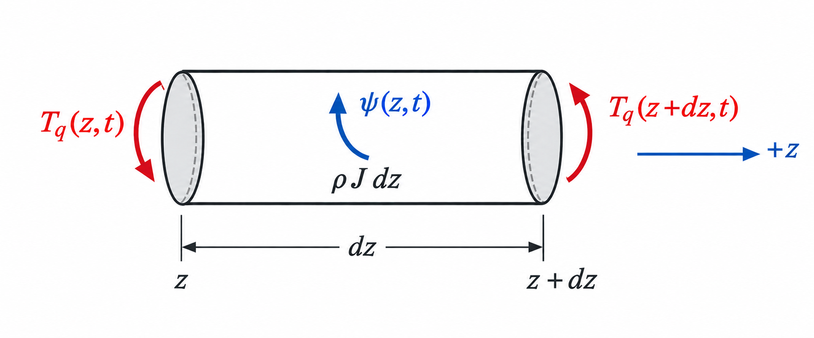

# Chapter 5 -- Torsional vibration

## Table of contents

- [5.1 Assumptions and coordinate](#51-assumptions-and-coordinate)
- [5.2 Differential free body and equation](#52-differential-free-body-and-equation)
- [5.3 Spatial and temporal harmonics](#53-spatial-and-temporal-harmonics)

## 5.1 Assumptions and coordinate

Let $\psi(z,t)=\theta_z(z,t)$ be the small twist about the shaft axis. Use the
same fixed--free pattern:

$$
\psi(0,t)=0,
\qquad
T_q(L,t)=0,
$$

where $T_q$ denotes internal torque.

## 5.2 Differential free body and equation

*Torsional differential element. The face torques act in opposite senses, and
$\psi(z,t)$ indicates positive twist about $+z$ by the right-hand rule.*

The slice's polar mass moment per unit length is $\rho J$. Angular-momentum
balance gives

$$
\frac{\partial T_q}{\partial z}
=\rho J\frac{\partial^2\psi}{\partial t^2}.
$$

Saint-Venant torsion supplies the constitutive relation

$$
T_q=GJ\frac{\partial\psi}{\partial z}.
$$

For constant $G$ and $J$,

$$
GJ\frac{\partial^2\psi}{\partial z^2}
=\rho J\frac{\partial^2\psi}{\partial t^2},
$$

so the torsional wave speed is

$$
c_t=\sqrt{\frac{G}{\rho}}.
$$

## 5.3 Spatial and temporal harmonics

The torsional wave equation has the same mathematical structure as the axial
one, but its field variable is twist and its wave speed depends on $G$ rather
than $E$. Seek one torsional normal mode as

$$
\psi(z,t)=\Psi(z)b(t).
$$

Substitution and division by $c_t^2\Psi b$ give

$$
\frac{\ddot b(t)}{c_t^2b(t)}
=\frac{\Psi''(z)}{\Psi(z)}
=-\kappa^2.
$$

As in the axial problem, the separation constant is negative because the
fixed--free boundary conditions admit nontrivial sinusoidal shapes, whereas
the zero and positive choices do not. The spatial and temporal equations are

$$
\Psi''+\kappa^2\Psi=0,
\qquad
\ddot b+\omega_t^2b=0,
\qquad
\omega_t=c_t\kappa.
$$

Their harmonic solutions are

$$
\Psi(z)=D_1\sin(\kappa z)+D_2\cos(\kappa z),
$$

$$
b(t)=P\cos(\omega_t t)+Q\sin(\omega_t t).
$$

The interpretation is identical to the spatial and temporal harmonics shown
in the [axial separation figure](04_axial_vibration.md#43-separation-of-variables-and-boundary-conditions):
$\Psi(z)$ fixes the twist pattern and $b(t)$ changes only its instantaneous
amplitude and sign.

The fixed condition $\Psi(0)=0$ gives $D_2=0$. The torque-free condition at
the other end is

$$
T_q(L,t)=GJ\Psi'(L)b(t)=0.
$$

For nonzero motion, this requires

$$
\cos(\kappa L)=0,
$$

and therefore

$$
\kappa_n=\frac{(2n-1)\pi}{2L},
\qquad
\omega_{t,n}=c_t\kappa_n.
$$

The complete $n$th torsional mode is

$$
\psi_n(z,t)=
\sin\left(\frac{(2n-1)\pi z}{2L}\right)
\left[
P_n\cos(\omega_{t,n}t)+Q_n\sin(\omega_{t,n}t)
\right],
$$

with cyclic natural frequency

$$
\boxed{
f_{t,n}=\frac{\omega_{t,n}}{2\pi}
=\frac{2n-1}{4L}\sqrt{\frac{G}{\rho}}
}.
$$

$P_n$ and $Q_n$ follow from the initial twist and angular velocity, and a
general torsional free response is the sum of the individual modal motions.

$J$ cancels for a uniform shaft because torsional stiffness and distributed
polar inertia both scale with it. As before, it does not generally cancel for
a stepped or composite shaft.
