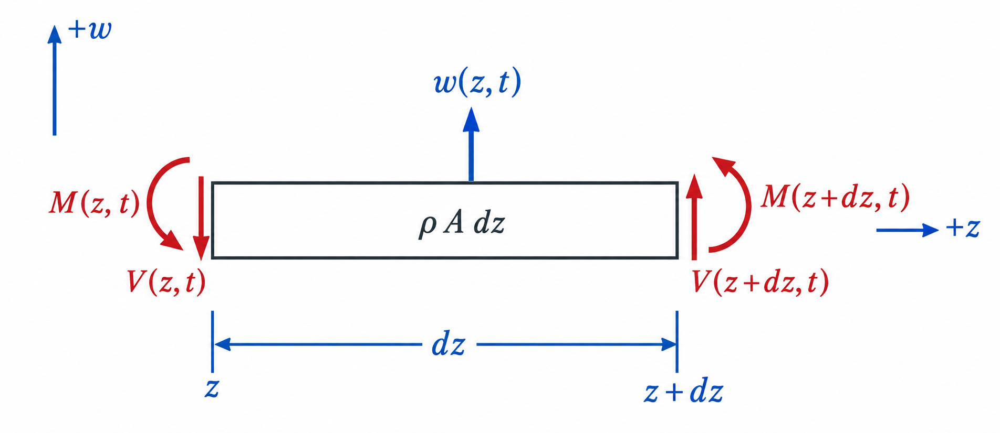

# Chapter 6 -- Flexural vibration

## Table of contents

- [6.1 Euler--Bernoulli assumptions](#61-euler--bernoulli-assumptions)
- [6.2 Differential free body](#62-differential-free-body)
- [6.3 Simply supported solution](#63-simply-supported-solution)
- [6.4 Worked stationary-shaft results](#64-worked-stationary-shaft-results)

Flexural vibration is the first model that resembles the lateral motion most
often associated with rotor dynamics.

## 6.1 Euler--Bernoulli assumptions

Assume:

- small transverse displacement;
- a straight, slender, uniform shaft;
- linear elastic material;
- plane cross-sections remain plane and normal to the deformed centerline;
- shear deformation and bending rotary inertia are neglected;
- there is no damping, axial load, or spin.

These are Euler--Bernoulli assumptions. Timoshenko theory relaxes the
normal-to-centerline assumption and retains shear deformation; it is discussed
in the [shaft-element formulation](../reference-manual/09_shaft_element_formulation.md), not in this
first analytical derivation.

## 6.2 Differential free body

Let $w(z,t)$ represent displacement in one transverse plane. A differential
slice carries shear $V$ and bending moment $M$:

*Flexural differential element and sign convention. Positive shear acts
downward on the left face and upward on the right face; positive bending
moment acts clockwise on the left face and counterclockwise on the right.*

Force balance and moment balance, with a consistent sign convention, give

$$
\frac{\partial V}{\partial z}
=\rho A\frac{\partial^2w}{\partial t^2},
\qquad
V=-\frac{\partial M}{\partial z}.
$$

With the transverse directions shown in the figure, the Euler--Bernoulli
curvature relation is

$$
M=EI\frac{\partial^2w}{\partial z^2}.
$$

Combining the three relations produces the standard free-vibration equation

$$
\boxed{
EI\frac{\partial^4w}{\partial z^4}
+\rho A\frac{\partial^2w}{\partial t^2}=0
}.
$$

The signs assigned separately to $V$, $M$, and curvature can differ among
texts; the combined governing equation and declared displacement/rotation
conventions must remain consistent.

## 6.3 Simply supported solution

A simple support imposes zero transverse displacement but does not restrain
bending rotation. With no applied end couple, the bending moment is also zero:

$$
w(0,t)=w(L,t)=0,
$$

$$
M(0,t)=M(L,t)=0
\quad\Longrightarrow\quad
\frac{\partial^2w}{\partial z^2}(0,t)
=\frac{\partial^2w}{\partial z^2}(L,t)=0.
$$

Set $w(z,t)=W(z)e^{i\omega t}$. The spatial equation is

$$
EI W''''-\rho A\omega^2W=0.
$$

The simply supported boundary conditions admit

$$
W_n(z)=\sin\left(\frac{n\pi z}{L}\right),
\qquad
\beta_n=\frac{n\pi}{L}.
$$

Substitution yields

$$
\omega_{b,n}=\beta_n^2\sqrt{\frac{EI}{\rho A}},
$$

and therefore

$$
\boxed{
f_{b,n}=\frac{n^2\pi}{2L^2}
\sqrt{\frac{EI}{\rho A}}
}.
$$

For a circular isotropic shaft, bending in $x$ and $y$ has the same $EI$.
Every analytical bending frequency therefore occurs as a degenerate pair: one
mode may bend in $x$ and the other in $y$. Small asymmetries in a real rotor
usually separate the pair.

The scaling is worth reading physically:

- $f_b\propto \sqrt{E}$: a stiffer material raises frequency;
- $f_b\propto 1/\sqrt{\rho}$: a denser material lowers frequency;
- $f_b\propto 1/L^2$: length has a particularly strong effect;
- for a solid circular shaft, $I/A=d^2/16$, so $f_b\propto d$.

## 6.4 Worked stationary-shaft results

Use the reference data employed by Spinniped's independent beam benchmark:

$$
E=2.0\times10^{11}\ \mathrm{Pa},\quad
\nu=0.3,\quad
\rho=7850\ \mathrm{kg/m^3},
$$

$$
d=0.01\ \mathrm m,\qquad L=1.0\ \mathrm m.
$$

The section and shear properties are

$$
A=7.853981634\times10^{-5}\ \mathrm{m^2},
$$

$$
I=4.908738521\times10^{-10}\ \mathrm{m^4},
$$

$$
G=7.692307692\times10^{10}\ \mathrm{Pa}.
$$

The first four analytical frequencies are:

| Mode $n$ | Axial, fixed--free (Hz) | Torsional, fixed--free (Hz) | Flexural, simply supported (Hz) |
|---:|---:|---:|---:|
| 1 | 1261.886163 | 782.588576 | 19.821661 |
| 2 | 3785.658488 | 2347.765729 | 79.286646 |
| 3 | 6309.430814 | 3912.942882 | 178.394953 |
| 4 | 8833.203140 | 5478.120035 | 317.146584 |

The different support labels in the headings are deliberate. The table is a
comparison of three wave mechanisms, not three responses of one fully defined
support arrangement.

The standalone
[`01_uniform_beam_frequencies.py`](../../benchmark/01_uniform_beam_frequencies.py)
script evaluates the corresponding uniform-beam reference frequencies.
