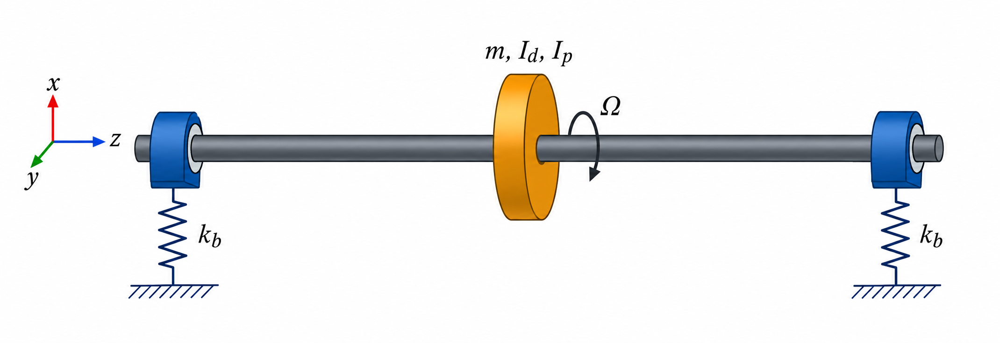

# Chapter 7 -- Extended Jeffcott rotor

## Table of contents

- [7.1 Assumptions](#71-assumptions)
- [7.2 Equivalent center-translation stiffness](#72-equivalent-center-translation-stiffness)
- [7.3 Equivalent center-rotation stiffness](#73-equivalent-center-rotation-stiffness)
- [7.4 Cylindrical translation modes](#74-cylindrical-translation-modes)
- [7.5 Conical modes and gyroscopic coupling](#75-conical-modes-and-gyroscopic-coupling)

A stationary shaft model does not yet explain what spin does. The next model
adds a rigid disk at the center, two isotropic bearings, and a constant spin
speed $\Omega$.

This is an *extended* Jeffcott model because it retains both disk translation
and disk tilt. The simplest classical Jeffcott model treats the disk as a
point mass and retains lateral translation only; that model cannot show the
gyroscopic splitting caused by disk rotational inertia.

## 7.1 Assumptions

- The disk is rigid and centered at $z=L/2$.
- The shaft is massless but elastically flexible.
- Each end bearing has transverse stiffness $k_b$ in both $x$ and $y$.
- The rotor is axisymmetric and undamped.
- Axial and torsional motion are excluded.
- The disk spins at constant speed $\Omega$ about global $z$.
- Motions and disk tilts are small.

The disk has mass $m$, equal diametral inertias $I_d$ about its local $x$ and
$y$ axes, and polar inertia $I_p$ about its spin axis.

## 7.2 Equivalent center-translation stiffness

Apply a transverse force $F$ at the disk. For a simply supported shaft with a
center force, symmetry gives end reactions $F/2$. On the left half, measured
from the left bearing,

$$
M(z)=\frac{Fz}{2},
\qquad 0\le z\le\frac{L}{2}.
$$

Using one consistent Euler--Bernoulli curvature sign convention,

$$
EI\frac{\mathrm d^2w}{\mathrm dz^2}=\frac{Fz}{2}.
$$

Integrating twice gives

$$
EI\frac{\mathrm dw}{\mathrm dz}=\frac{Fz^2}{4}+C_1,
$$

$$
EIw=\frac{Fz^3}{12}+C_1z+C_2.
$$

The left support imposes $w(0)=0$, so $C_2=0$. Symmetry imposes zero slope at
the center, $w'(L/2)=0$, which gives $C_1=-FL^2/16$. The sign of $w$ depends
on the chosen transverse direction; the magnitude of the center deflection is
therefore

$$
\delta_s=\frac{FL^3}{48EI}.
$$

The two identical bearings act in parallel. Each carries $F/2$, so both ends
translate by

$$
\delta_b=\frac{F/2}{k_b}=\frac{F}{2k_b}.
$$

The disk displacement is the bearing translation plus shaft bending:

$$
\delta_t=F\left(\frac{L^3}{48EI}+\frac{1}{2k_b}\right).
$$

Hence the equivalent translational stiffness is

$$
\boxed{
k_t=\left(\frac{L^3}{48EI}+\frac{1}{2k_b}\right)^{-1}
}.
$$

This is a compliance calculation: deformations in series add, so inverse
stiffnesses add.

## 7.3 Equivalent center-rotation stiffness

Now apply a moment $M_c$ at the disk. The shaft's center rotation due to
bending can be obtained from its moment diagram. The bearing reactions have
magnitude $M_c/L$, so

$$
M(z)=
\begin{cases}
M_cz/L, & 0\le z<L/2,\\
-M_c(1-z/L), & L/2<z\le L.
\end{cases}
$$

The bending strain energy is

$$
U=\int_0^L\frac{M(z)^2}{2EI}\,\mathrm dz
=\frac{M_c^2L}{24EI}.
$$

By Castigliano's theorem, rotation in the direction of $M_c$ is the derivative
of strain energy with respect to that moment:

$$
\theta_s=\frac{\partial U}{\partial M_c}
=\frac{M_cL}{12EI}.
$$

Castigliano's theorem is an energy form of the same linear-elastic beam
equations used earlier; it is convenient here because the desired response is
a rotation at the applied moment.

The equal-and-opposite bearing forces form a couple. Each has magnitude
$M_c/L$, producing an end displacement $M_c/(k_bL)$. The relative end
displacement divided by $L$ contributes

$$
\theta_b=\frac{2M_c}{k_bL^2}.
$$

Thus

$$
\theta_c=M_c\left(\frac{L}{12EI}+\frac{2}{k_bL^2}\right),
$$

and the equivalent rotational stiffness is

$$
\boxed{
k_r=\left(\frac{L}{12EI}+\frac{2}{k_bL^2}\right)^{-1}
}.
$$

$k_r$ has units $\mathrm{N\,m/rad}$; radians are dimensionless in the
equations.

## 7.4 Cylindrical translation modes

The disk translations $x_d$ and $y_d$ satisfy two identical equations:

$$
m\ddot x_d+k_tx_d=0,
\qquad
m\ddot y_d+k_ty_d=0.
$$

Therefore the cylindrical pair has the spin-independent frequency

$$
\boxed{
\omega_t=\sqrt{\frac{k_t}{m}},
\qquad
f_t=\frac{1}{2\pi}\sqrt{\frac{k_t}{m}}
}.
$$

The motion is called cylindrical because the disk axis translates without
tilting in this reduced model.

## 7.5 Conical modes and gyroscopic coupling

Let $\theta_x$ and $\theta_y$ describe disk tilt. Disk angular momentum adds
velocity coupling when $\Omega\ne0$:

$$
I_d\ddot\theta_x+I_p\Omega\dot\theta_y+k_r\theta_x=0,
$$

$$
I_d\ddot\theta_y-I_p\Omega\dot\theta_x+k_r\theta_y=0.
$$

The off-diagonal terms are equal and opposite. They do no work in this ideal
model; instead, they split the two circular whirling solutions.

For harmonic tilts

$$
\theta_x=\Theta_xe^{i\omega t},
\qquad
\theta_y=\Theta_ye^{i\omega t},
$$

the equations become

$$
\begin{bmatrix}
k_r-I_d\omega^2 & iI_p\Omega\omega\\
-iI_p\Omega\omega & k_r-I_d\omega^2
\end{bmatrix}
\begin{bmatrix}
\Theta_x\\
\Theta_y
\end{bmatrix}
=\mathbf 0.
$$

A nonzero tilt requires the determinant to vanish:

$$
(k_r-I_d\omega^2)^2-(I_p\Omega\omega)^2=0.
$$

Factoring gives two quadratic equations,

$$
I_d\omega^2+I_p\Omega\omega-k_r=0,
$$

$$
I_d\omega^2-I_p\Omega\omega-k_r=0.
$$

Solving them and retaining the two positive frequency magnitudes gives

$$
\boxed{
\omega_{c,-}(\Omega)=
\frac{\sqrt{(I_p\Omega)^2+4I_dk_r}-I_p\Omega}{2I_d}
},
$$

$$
\boxed{
\omega_{c,+}(\Omega)=
\frac{\sqrt{(I_p\Omega)^2+4I_dk_r}+I_p\Omega}{2I_d}
}.
$$

Following the labels used by this project's benchmark,
$\omega_{c,-}$ is the decreasing backward-conical branch and
$\omega_{c,+}$ is the increasing forward-conical branch. Whirl labels can
depend on the observer and sign convention, so always state the convention
when comparing another reference.

At rest,

$$
\omega_{c,-}(0)=\omega_{c,+}(0)=\sqrt{\frac{k_r}{I_d}}.
$$

The branches are degenerate at zero speed. As $\Omega$ grows, polar inertia
$I_p$ produces the gyroscopic separation. Diametral inertia $I_d$ supplies the
tilt inertia even at rest. This is why a point-mass Jeffcott model cannot
represent conical splitting.
