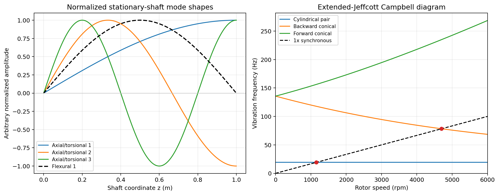

# Chapter 8 -- Critical speeds and Campbell diagrams

## Table of contents

- [8.1 Cylindrical critical speed](#81-cylindrical-critical-speed)
- [8.2 Backward-conical critical speed](#82-backward-conical-critical-speed)
- [8.3 Worked extended-Jeffcott result](#83-worked-extended-jeffcott-result)

A Campbell diagram plots modal frequency vertically against rotor speed
horizontally. A synchronous, or 1x, excitation has cyclic frequency

$$
f_{1x}=\frac{\Omega}{2\pi}.
$$

An ideal critical speed occurs where this line meets a modal branch.

## 8.1 Cylindrical critical speed

Because $\omega_t$ is constant, its 1x crossing is simply

$$
\boxed{
\Omega_{t,\mathrm{crit}}=\sqrt{\frac{k_t}{m}}
}.
$$

## 8.2 Backward-conical critical speed

Set $\omega_{c,-}(\Omega)=\Omega$:

$$
2I_d\Omega
=\sqrt{(I_p\Omega)^2+4I_dk_r}-I_p\Omega.
$$

Move the gyroscopic term to the left and square:

$$
(2I_d+I_p)^2\Omega^2
=I_p^2\Omega^2+4I_dk_r.
$$

After cancellation,

$$
4I_d(I_d+I_p)\Omega^2=4I_dk_r,
$$

so

$$
\boxed{
\Omega_{c,\mathrm{crit}}
=\sqrt{\frac{k_r}{I_d+I_p}}
}.
$$

In a real machine, damping, imbalance location, anisotropy, and mode shape
determine the size of the response near a crossing. A Campbell intersection
identifies a possible resonance; it is not by itself a response amplitude.

## 8.3 Worked extended-Jeffcott result

Use

$$
E=2.0\times10^{11}\ \mathrm{Pa},\quad
d=0.02\ \mathrm m,\quad
L=1.0\ \mathrm m,
$$

$$
m=5.0\ \mathrm{kg},\quad
I_d=0.025\ \mathrm{kg\,m^2},\quad
I_p=0.05\ \mathrm{kg\,m^2},
$$

$$
k_b=1.0\times10^6\ \mathrm{N/m}.
$$

Then

| Quantity | Analytical value |
|---|---:|
| $I$ | $7.853981634\times10^{-9}\ \mathrm{m^4}$ |
| $k_t$ | $72659.042323\ \mathrm{N/m}$ |
| $k_r$ | $18164.760581\ \mathrm{N\,m/rad}$ |
| Cylindrical frequency at rest | $19.185802264\ \mathrm{Hz}$ |
| Conical frequency at rest | $135.664108836\ \mathrm{Hz}$ |
| Cylindrical 1x critical speed | $1151.148135859\ \mathrm{rpm}$ |
| Backward-conical 1x critical speed | $4699.542585350\ \mathrm{rpm}$ |

The companion script computes the mode shapes and Campbell curves directly
from the equations in this guide:

```bash
python doc/theory-manual/plot_analytical_rotordynamics.py
```

It writes the following figure without importing Spinniped:



The dashed 1x line intersects the cylindrical branch and the decreasing
conical branch at the two tabulated critical speeds.

For the direct analytical-to-finite-element comparison, run
[`02_flexible_bearing_jeffcott_comparison.py`](../../benchmark/02_flexible_bearing_jeffcott_comparison.py).
