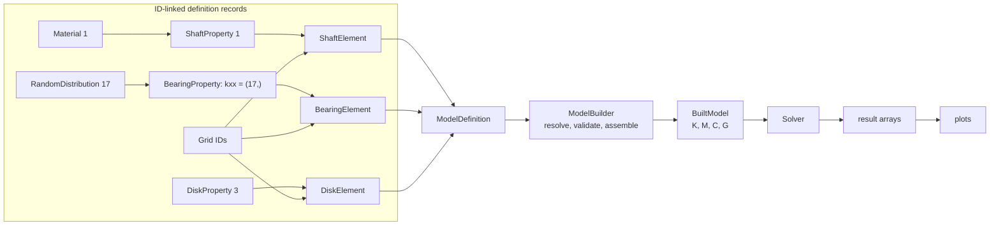

# Chapter 2 -- Model-definition API

## Table of contents

- [How the records fit together](#how-the-records-fit-together)
- [Record reference](#record-reference)
- [Coordinate systems](#coordinate-systems)
- [Spin-axis convention](#spin-axis-convention)

A model definition is data, not a collection of stateful finite-element
objects. Records refer to one another by integer IDs:

- `Grid` defines a point and its input coordinate system.
- `CoordinateSystem` defines a local Cartesian frame.
- `Material` defines density, Young's modulus, and Poisson's ratio.
- `ShaftProperty`, `BearingProperty`, and `DiskProperty` define reusable
  physical data.
- `ShaftElement`, `BearingElement`, and `DiskElement` define connectivity and
  reference a compatible property.
- `ModelDefinition` holds the record lists.

`LumpedMassElement` and `LumpedMassProperty` are aliases for the corresponding
disk records.

## How the records fit together

The left side of this diagram shows the ID references used by one typical
rotor definition. The right side shows when declarative records become
numerical arrays and, finally, analysis results.



The arrows among definition records are integer references, not copied
numerical data. `ModelBuilder` is the boundary between that declarative graph
and the assembled numerical model.

This example defines a three-grid shaft with a disk and two bearings:

```python
from spinniped import (
    BearingElement,
    BearingProperty,
    DiskElement,
    DiskProperty,
    Grid,
    Material,
    ModelDefinition,
    RandomDistribution,
    ShaftElement,
    ShaftProperty,
)

definition = ModelDefinition(
    grids=[
        Grid(1, z=0.0),
        Grid(2, z=0.5),
        Grid(3, z=1.0),
    ],
    materials=[
        Material(
            id=1,
            density=7850.0,
            young_modulus=(1,),
            poisson_ratio=0.3,
        ),
    ],
    properties=[
        ShaftProperty(
            id=1,
            material=1,
            outer_diameter=(2,),
            theory="timoshenko",
        ),
        BearingProperty(
            id=2,
            kxx=1e8,
            kyy=1e8,
            cxx=100.0,
            cyy=100.0,
        ),
        DiskProperty(
            id=3,
            mass=2.0,
            diametral_inertia=0.01,
            polar_inertia=0.02,
        ),
    ],
    elements=[
        ShaftElement(1, grid_a=1, grid_b=2, property=1),
        ShaftElement(2, grid_a=2, grid_b=3, property=1),
        BearingElement(3, grid=1, property=2),
        BearingElement(4, grid=3, property=2),
        DiskElement(5, grid=2, property=3),
    ],
    distributions=[
        RandomDistribution(
            id=1,
            name="steel Young modulus",
            distribution="normal",
            parameters={"mean": 210e9, "stdv": 5e9},
        ),
        RandomDistribution(
            id=2,
            name="shaft diameter",
            distribution="uniform",
            parameters={"low": 0.019, "high": 0.021},
        ),
    ],
    spin_axis=(0.0, 0.0, 1.0),
)
```

## Record reference

All dimensions and coefficients must use one coherent unit system; examples
and theory notes use SI.

| Record | Fields |
|---|---|
| `Grid` | `id`; coordinates `x`, `y`, `z` (default `0.0`); `coordinate_system` (default global ID `0`) |
| `CoordinateSystem` | `id`; `origin`; direction `x_axis`; direction `xy_plane` |
| `Material` | `id`; `density`; `young_modulus`; `poisson_ratio` |
| `ShaftProperty` | `id`; material reference `material`; `outer_diameter`; `inner_diameter` (default `0.0`); `theory`; `rotary_inertia`; `damping` |
| `BearingProperty` | `id`; stiffnesses `kxx`, `kyy`, `kzz`, `kxy`, `kyx`; damping coefficients `cxx`, `cyy`, `czz`, `cxy`, `cyx` |
| `DiskProperty` | `id`; `mass`; `diametral_inertia`; `polar_inertia`; `damping` |
| `ShaftElement` | `id`; end references `grid_a`, `grid_b`; shaft `property` reference |
| `BearingElement` | `id`; first `grid`; bearing `property`; optional `grid_b`; property `coordinate_system` |
| `DiskElement` | `id`; nodal `grid`; disk `property`; property `coordinate_system` |
| `RandomDistribution` | unique `id`; unique `name`; `distribution`; family-specific `parameters` |

`ShaftProperty.theory` accepts `"timoshenko"` (the default) and `"euler"`.
Bending rotary inertia is enabled by default. Shaft and disk `damping` values
are coefficients in the mass-proportional relation
$\mathbf{C}=\alpha\mathbf{M}$. Bearing coefficients default to zero and occupy
the translational x-y-z block.

`ModelDefinition` groups the `grids`, `coordinate_systems`, `materials`,
`properties`, `elements`, and `distributions` lists; each defaults to an empty
list. Its `spin_axis` field is the global spin direction and defaults to
`(0.0, 0.0, 1.0)`.

IDs must be unique positive integers within each record category. A shaft
element must reference a `ShaftProperty`, a bearing element a
`BearingProperty`, and a disk element a `DiskProperty`. A shaft property also
references a material ID. The builder validates these relationships.

## Coordinate systems

`Grid.x`, `Grid.y`, and `Grid.z` are interpreted in the coordinate system
selected by `Grid.coordinate_system`. System `0` is reserved for the global
Cartesian system and must not be redefined. A custom system is defined by a
global origin, a direction for its positive x-axis, and another direction in
its x-y plane. The two direction vectors need not be normalized, but they must
be nonzero and non-collinear:

```python
from spinniped import CoordinateSystem, Grid

frame = CoordinateSystem(
    id=10,
    origin=(1.0, 0.0, 0.0),
    x_axis=(0.0, 1.0, 0.0),
    xy_plane=(0.0, 0.0, 1.0),
)

point = Grid(20, x=0.5, coordinate_system=10)
```

Shaft matrices are formulated in an element-local frame whose z-axis runs
from `grid_a` to `grid_b`, then transformed into the global frame during
assembly. Shaft elements therefore need not be parallel to the global z-axis.

`BearingElement.coordinate_system` rotates bearing coefficients from the
selected local frame into the global frame. With `grid_b=None` (the default),
the bearing connects `grid` to ground. Supplying `grid_b` creates a relative
two-grid bearing with the block pattern

$$
\begin{bmatrix}
\mathbf{A}_b & -\mathbf{A}_b\\
-\mathbf{A}_b & \mathbf{A}_b
\end{bmatrix},
$$

for both bearing stiffness and damping. `DiskElement.coordinate_system`
similarly orients disk inertia and its local spin axis. These element
coordinate-system fields default to global system `0`. A grid's own
`coordinate_system` locates the grid; it does not implicitly orient an attached
bearing or disk.

## Spin-axis convention

`ModelDefinition.spin_axis` is a nonzero direction expressed in global
coordinates. The builder normalizes it, so it defines orientation rather than
speed. For each shaft, the unit-speed gyroscopic matrix is multiplied by the
projection of this direction onto the shaft's local axis. Reversing
`grid_a`/`grid_b` therefore does not reverse the physical global gyroscopic
effect. A shaft perpendicular to the spin axis has zero gyroscopic
contribution in the current formulation.

For a disk, the same projection uses the local z-axis selected by
`DiskElement.coordinate_system`. The scalar `speed` or each Campbell `speeds`
value later supplies the angular-speed magnitude in rad/s.
