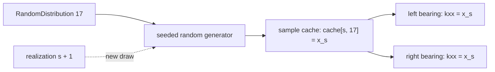

# Chapter 3 -- Random parameters

## Table of contents

- [Reference reuse at a glance](#reference-reuse-at-a-glance)
- [Deterministic build](#deterministic-build)
- [Stochastic build](#stochastic-build)

Random distributions are registered once in ``ModelDefinition.distributions``.
Each distribution has a unique integer ``id``, a unique descriptive ``name``,
a family, and its parameters:

```python
RandomDistribution(
    id=17,
    name="bearing stiffness",
    distribution="normal",
    parameters={"mean": 1.0e8, "stdv": 1.0e6},
)
```

Any numeric model parameter can reference this scalar distribution with a
one-item tuple. Reusing the reference reuses exactly the same draw:

```python
BearingProperty(id=1, kxx=(17,), kyy=(17,))
```

Correlated variables use one multivariate distribution and select components
with ``(distribution_id, component_index)``:

```python
RandomDistribution(
    id=18,
    name="correlated bearing stiffness",
    distribution="multivariate_normal",
    parameters={
        "mean": [1.0e8, 1.2e8],
        "stdv": [1.0e7, 2.0e7],
        "correlation": [[1.0, 0.8], [0.8, 1.0]],
    },
)

BearingProperty(id=1, kxx=(18, 0), kyy=(18, 1))
```

## Reference reuse at a glance

Within realization `s`, the builder resolves a distribution once and stores
the draw in a sample cache. Every field using the same reference receives that
same value:



This is shared uncertainty, not two independent bearing draws. Use distinct
distribution IDs when the physical parameters must vary independently.

The supported families are ``"normal"``, ``"uniform"``, and
``"multivariate_normal"``. Schemas are strict, all parameters must be finite,
standard deviations must be nonnegative, and correlation matrices must be
symmetric and positive semidefinite with a unit diagonal. Distribution IDs and
names must both be unique.

Resolved records and numerical inputs are validated for type, shape, finite
values, references, and physical bounds. For example, shaft length, density,
and Young's modulus must be positive; `outer_diameter > inner_diameter >= 0`;
Poisson's ratio must lie strictly between `-1` and `0.5`; and disk mass and
inertias cannot be negative. A stochastic draw that violates a physical bound
raises an error identifying its sample and field path; the builder does not
silently clip or resample it.

## Deterministic build

The default build is deterministic. Normal distributions resolve to their
means and uniform distributions to their interval midpoints. Exactly one set of
global matrices is assembled:

```python
from spinniped import ModelBuilder

model = ModelBuilder().build(definition)

# Equivalent, explicit form:
model = ModelBuilder().build(definition, stochastic=False)
```

## Stochastic build

A stochastic build draws the requested number of Monte Carlo realizations and
assembles one matrix set per realization:

```python
ensemble = ModelBuilder().build(
    definition,
    stochastic=True,
    samples=1_000,
    seed=42,
)
```

The seed initializes NumPy's random generator, making the sampled definitions
and assembled matrices reproducible. `samples` must be a positive integer.
The convenience function `build_model(definition, **options)` has the same
behavior as `ModelBuilder().build(...)`.
