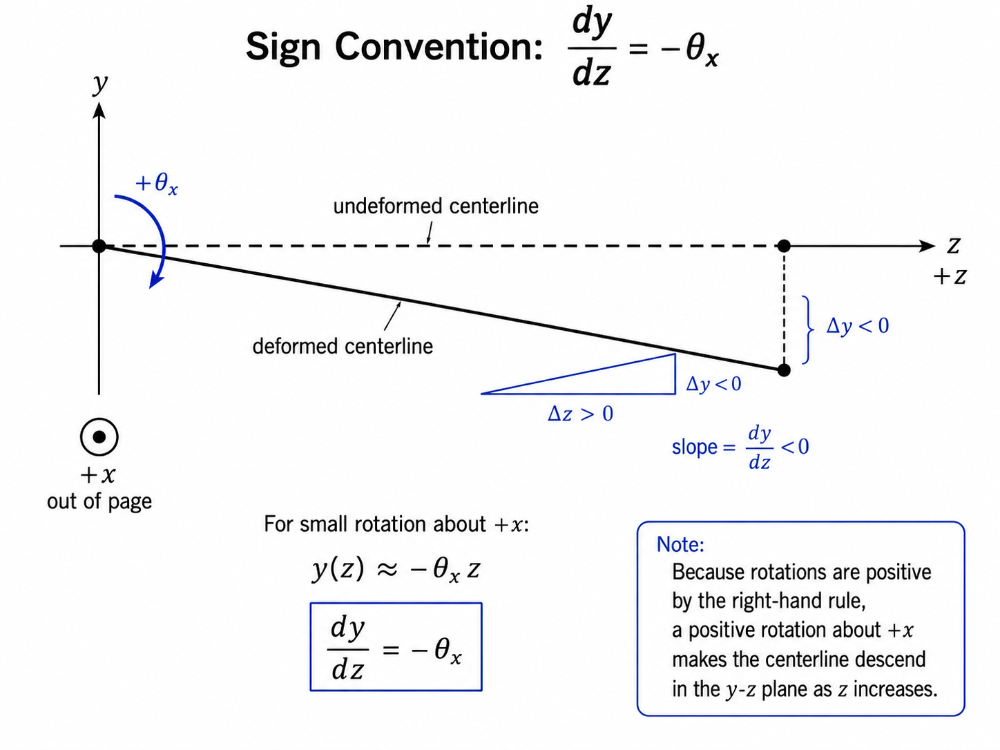

# Shaft Element Theory Notes

This note documents the two-node shaft element implemented in `ShaftElement`.
It follows the Spinniped notation convention:

```text
x0, y0, z0, tx0, ty0, tz0, x1, y1, z1, tx1, ty1, tz1
```

The shaft axis is the local/global `z` axis. The transverse directions are `x` and `y`.
Each node has six mechanical degrees of freedom.

---

## 1. Element degree-of-freedom vector

For a two-node shaft element connecting node 0 and node 1:

$$
\mathbf{q}_e =
\begin{bmatrix}
 x_0 & y_0 & z_0 & \theta_{x_0} & \theta_{y_0} & \theta_{z_0} &
 x_1 & y_1 & z_1 & \theta_{x_1} & \theta_{y_1} & \theta_{z_1}
\end{bmatrix}^T
$$

The local zero-based index map is:

| Local index | DOF |
|---:|---|
| 0 | $x_0$ |
| 1 | $y_0$ |
| 2 | $z_0$ |
| 3 | $\theta_{x_0}$ |
| 4 | $\theta_{y_0}$ |
| 5 | $\theta_{z_0}$ |
| 6 | $x_1$ |
| 7 | $y_1$ |
| 8 | $z_1$ |
| 9 | $\theta_{x_1}$ |
| 10 | $\theta_{y_1}$ |
| 11 | $\theta_{z_1}$ |

The element matrix blocks are inserted through the following local index sets:

| Physical contribution | Local DOF subset | Python indices |
|---|---|---:|
| Axial deformation along $z$ | $[z_0, z_1]$ | `[2, 8]` |
| Torsion about $z$ | $[\theta_{z_0}, \theta_{z_1}]$ | `[5, 11]` |
| Bending in the $x$-$z$ plane | $[x_0, \theta_{y_0}, x_1, \theta_{y_1}]$ | `[0, 4, 6, 10]` |
| Bending in the $y$-$z$ plane | $[y_0, \theta_{x_0}, y_1, \theta_{x_1}]$ | `[1, 3, 7, 9]` |

The bending sign convention used in the code is:

$$
\frac{dx}{dz} = \theta_y,
\qquad
\frac{dy}{dz} = -\theta_x
$$

This explains why the $x$-$z$ and $y$-$z$ bending matrices have the same physical content but different signs in the displacement-rotation coupling terms.

<p align="center">
  
</p>

---

## 2. Geometric and material quantities

For a circular solid shaft with diameter $d$ and element length $L$:

$$
A = \frac{\pi d^2}{4}
$$

$$
I = I_x = I_y = \frac{\pi d^4}{64}
$$

$$
J = I_p = \frac{\pi d^4}{32}
$$

In this document, $J$ is the **geometric polar second moment of area**, not a lumped mass moment of inertia.
The torsional mass terms use $\rho J$ as the distributed polar mass moment per unit length.

The shear modulus is:

$$
G = \frac{E}{2(1+\nu)}
$$

The shear correction factor used by the implementation is:

$$
\kappa = \frac{6(1+\nu)}{7+6\nu}
$$

The Timoshenko shear parameter is:

$$
\phi = \frac{12EI}{\kappa G A L^2}
$$

When $\phi \to 0$, the bending stiffness terms reduce to the Euler-Bernoulli stiffness terms.

---

## 3. Element stiffness matrix structure

The complete element stiffness matrix is a $12 \times 12$ matrix:

$$
\mathbf{K}_e \in \mathbb{R}^{12 \times 12}
$$

It is assembled by inserting smaller axial, torsional, and bending matrices into the Spinniped local ordering:

$$
\mathbf{K}_e[\mathcal{I}_a, \mathcal{I}_a] = \mathbf{K}_{a}
$$

$$
\mathbf{K}_e[\mathcal{I}_t, \mathcal{I}_t] = \mathbf{K}_{t}
$$

$$
\mathbf{K}_e[\mathcal{I}_{bx}, \mathcal{I}_{bx}] = \mathbf{K}_{bx}
$$

$$
\mathbf{K}_e[\mathcal{I}_{by}, \mathcal{I}_{by}] = \mathbf{K}_{by}
$$

where:

$$
\mathcal{I}_a = [2,8]
$$

$$
\mathcal{I}_t = [5,11]
$$

$$
\mathcal{I}_{bx} = [0,4,6,10]
$$

$$
\mathcal{I}_{by} = [1,3,7,9]
$$

---

## 4. Axial stiffness matrix

The axial deformation is governed by the two degree-of-freedom vector:

$$
\mathbf{q}_a =
\begin{bmatrix}
 z_0 & z_1
\end{bmatrix}^T
$$

The axial stiffness matrix is:

$$
\mathbf{K}_a = \frac{EA}{L}
\begin{bmatrix}
 1 & -1 \\
 -1 & 1
\end{bmatrix}
$$

This matrix is identical for Timoshenko and Euler-Bernoulli beam theory because shear deformation affects bending, not axial extension.

---

## 5. Torsional stiffness matrix

The torsional deformation is governed by:

$$
\mathbf{q}_t =
\begin{bmatrix}
 \theta_{z_0} & \theta_{z_1}
\end{bmatrix}^T
$$

The torsional stiffness matrix is:

$$
\mathbf{K}_t = \frac{GJ}{L}
\begin{bmatrix}
 1 & -1 \\
 -1 & 1
\end{bmatrix}
$$

This matrix is also identical for the Timoshenko and Euler-Bernoulli implementations in the current class.

---

## 6. Timoshenko bending stiffness matrices

Timoshenko beam theory includes both bending deformation and shear deformation.
The shear flexibility enters through $\phi$.
The scalar multiplier is:

$$
k_0 = \frac{EI}{L^3(1+\phi)}
$$

Define:

$$
k_1 = 12
$$

$$
k_2 = 6L
$$

$$
k_3 = (4+\phi)L^2
$$

$$
k_4 = (2-\phi)L^2
$$

### 6.1 Bending in the $x$-$z$ plane

The active bending vector is:

$$
\mathbf{q}_{bx} =
\begin{bmatrix}
 x_0 & \theta_{y_0} & x_1 & \theta_{y_1}
\end{bmatrix}^T
$$

The Timoshenko bending stiffness matrix in the $x$-$z$ plane is:

$$
\mathbf{K}_{bx}^{T} = k_0
\begin{bmatrix}
 k_1 & k_2 & -k_1 & k_2 \\
 k_2 & k_3 & -k_2 & k_4 \\
 -k_1 & -k_2 & k_1 & -k_2 \\
 k_2 & k_4 & -k_2 & k_3
\end{bmatrix}
$$

The superscript $T$ indicates Timoshenko, not transpose.

### 6.2 Bending in the $y$-$z$ plane

The active bending vector is:

$$
\mathbf{q}_{by} =
\begin{bmatrix}
 y_0 & \theta_{x_0} & y_1 & \theta_{x_1}
\end{bmatrix}^T
$$

Because $dy/dz = -\theta_x$, the displacement-rotation coupling signs differ from the $x$-$z$ plane:

$$
\mathbf{K}_{by}^{T} = k_0
\begin{bmatrix}
 k_1 & -k_2 & -k_1 & -k_2 \\
 -k_2 & k_3 & k_2 & k_4 \\
 -k_1 & k_2 & k_1 & k_2 \\
 -k_2 & k_4 & k_2 & k_3
\end{bmatrix}
$$

---

## 7. Euler-Bernoulli bending stiffness matrices

Euler-Bernoulli beam theory neglects shear deformation.
For the implemented matrix, this corresponds to setting $\phi = 0$ in the Timoshenko bending stiffness.
The scalar multiplier is:

$$
k_0 = \frac{EI}{L^3}
$$

Define:

$$
k_1 = 12
$$

$$
k_2 = 6L
$$

$$
k_3 = 4L^2
$$

$$
k_4 = 2L^2
$$

### 7.1 Bending in the $x$-$z$ plane

$$
\mathbf{K}_{bx}^{EB} = k_0
\begin{bmatrix}
 k_1 & k_2 & -k_1 & k_2 \\
 k_2 & k_3 & -k_2 & k_4 \\
 -k_1 & -k_2 & k_1 & -k_2 \\
 k_2 & k_4 & -k_2 & k_3
\end{bmatrix}
$$

### 7.2 Bending in the $y$-$z$ plane

$$
\mathbf{K}_{by}^{EB} = k_0
\begin{bmatrix}
 k_1 & -k_2 & -k_1 & -k_2 \\
 -k_2 & k_3 & k_2 & k_4 \\
 -k_1 & k_2 & k_1 & k_2 \\
 -k_2 & k_4 & k_2 & k_3
\end{bmatrix}
$$

Here $EB$ means Euler-Bernoulli.

---

## 8. Element mass matrix structure

The implemented mass matrix can be split into translational and rotary-inertia contributions:

$$
\mathbf{M}_e = \mathbf{M}_{e,\mathrm{trans}} + \mathbf{M}_{e,\mathrm{rot}}
$$

The code allows rotary inertia to be disabled:

```python
M = M_trans                      # if rotary_inertia is False
M = M_trans + M_rot              # if rotary_inertia is True
```

In the current class, `rotary_inertia=True` is the default in `_M()`. 

The rotary inertia is influent on high frequency modes, where the rotational energy terms of the beam section are not negligible. Setting `rotary_inertia=False` may result in bad approximations on high-frequency bending modes.

---

## 9. Axial mass matrix

The consistent axial mass matrix is:

$$
\mathbf{M}_a = \frac{\rho A L}{6}
\begin{bmatrix}
 2 & 1 \\
 1 & 2
\end{bmatrix}
$$

It is inserted into the local indices `[2, 8]`.

---

## 10. Torsional inertia matrix

The consistent torsional inertia matrix is:

$$
\mathbf{M}_t = \frac{\rho J L}{6}
\begin{bmatrix}
 2 & 1 \\
 1 & 2
\end{bmatrix}
$$

It is inserted into the local indices `[5, 11]`.

Although this is an inertia term associated with rotation about the shaft axis, the implementation stores it inside the translational mass method because torsional modes require it even when bending rotary inertia is disabled.

---

## 11. Euler-Bernoulli translational bending mass matrices

The Euler-Bernoulli translational bending mass multiplier is:

$$
m_0 = \frac{\rho A L}{420}
$$

Define:

$$
m_1 = 156
$$

$$
m_2 = 22L
$$

$$
m_3 = 54
$$

$$
m_4 = -13L
$$

$$
m_5 = 4L^2
$$

$$
m_6 = -3L^2
$$

### 11.1 Bending inertia in the $x$-$z$ plane

For:

$$
\mathbf{q}_{bx} =
\begin{bmatrix}
 x_0 & \theta_{y_0} & x_1 & \theta_{y_1}
\end{bmatrix}^T
$$

$$
\mathbf{M}_{bx,\mathrm{trans}}^{EB} = m_0
\begin{bmatrix}
 m_1 & m_2 & m_3 & m_4 \\
 m_2 & m_5 & -m_4 & m_6 \\
 m_3 & -m_4 & m_1 & -m_2 \\
 m_4 & m_6 & -m_2 & m_5
\end{bmatrix}
$$

Expanded:

$$
\mathbf{M}_{bx,\mathrm{trans}}^{EB} = \frac{\rho A L}{420}
\begin{bmatrix}
 156 & 22L & 54 & -13L \\
 22L & 4L^2 & 13L & -3L^2 \\
 54 & 13L & 156 & -22L \\
 -13L & -3L^2 & -22L & 4L^2
\end{bmatrix}
$$

### 11.2 Bending inertia in the $y$-$z$ plane

For:

$$
\mathbf{q}_{by} =
\begin{bmatrix}
 y_0 & \theta_{x_0} & y_1 & \theta_{x_1}
\end{bmatrix}^T
$$

$$
\mathbf{M}_{by,\mathrm{trans}}^{EB} = m_0
\begin{bmatrix}
 m_1 & -m_2 & m_3 & -m_4 \\
 -m_2 & m_5 & m_4 & m_6 \\
 m_3 & m_4 & m_1 & m_2 \\
 -m_4 & m_6 & m_2 & m_5
\end{bmatrix}
$$

Expanded:

$$
\mathbf{M}_{by,\mathrm{trans}}^{EB} = \frac{\rho A L}{420}
\begin{bmatrix}
 156 & -22L & 54 & 13L \\
 -22L & 4L^2 & -13L & -3L^2 \\
 54 & -13L & 156 & 22L \\
 13L & -3L^2 & 22L & 4L^2
\end{bmatrix}
$$

---

## 12. Timoshenko translational bending mass matrices

The Timoshenko translational bending mass matrix includes shear-flexibility terms through $\phi$.
The scalar multiplier is:

$$
m_0 = \frac{\rho A L}{840(1+\phi)^2}
$$

Define:

$$
m_1 = 312 + 588\phi + 280\phi^2
$$

$$
m_2 = (44 + 77\phi + 35\phi^2)L
$$

$$
m_3 = 108 + 252\phi + 140\phi^2
$$

$$
m_4 = -(26 + 63\phi + 35\phi^2)L
$$

$$
m_5 = (8 + 14\phi + 7\phi^2)L^2
$$

$$
m_6 = -(6 + 14\phi + 7\phi^2)L^2
$$

### 12.1 Bending inertia in the $x$-$z$ plane

$$
\mathbf{M}_{bx,\mathrm{trans}}^{T} = m_0
\begin{bmatrix}
 m_1 & m_2 & m_3 & m_4 \\
 m_2 & m_5 & -m_4 & m_6 \\
 m_3 & -m_4 & m_1 & -m_2 \\
 m_4 & m_6 & -m_2 & m_5
\end{bmatrix}
$$

### 12.2 Bending inertia in the $y$-$z$ plane

$$
\mathbf{M}_{by,\mathrm{trans}}^{T} = m_0
\begin{bmatrix}
 m_1 & -m_2 & m_3 & -m_4 \\
 -m_2 & m_5 & m_4 & m_6 \\
 m_3 & m_4 & m_1 & m_2 \\
 -m_4 & m_6 & m_2 & m_5
\end{bmatrix}
$$

If $\phi = 0$, these expressions reduce to the Euler-Bernoulli consistent translational bending mass matrix.

---

## 13. Euler-Bernoulli rotary inertia contribution

Strict Euler-Bernoulli beam theory neglects rotary inertia.
When the implementation adds `M_rot_euler()`, the inertia model is closer to a Rayleigh beam model.
The scalar multiplier is:

$$
r_0 = \frac{\rho I}{30L}
$$

Define:

$$
r_7 = 36
$$

$$
r_8 = 3L
$$

$$
r_9 = 4L^2
$$

$$
r_{10} = -L^2
$$

### 13.1 Rotary inertia in the $x$-$z$ bending plane

$$
\mathbf{M}_{bx,\mathrm{rot}}^{EB} = r_0
\begin{bmatrix}
 r_7 & r_8 & -r_7 & r_8 \\
 r_8 & r_9 & -r_8 & r_{10} \\
 -r_7 & -r_8 & r_7 & -r_8 \\
 r_8 & r_{10} & -r_8 & r_9
\end{bmatrix}
$$

### 13.2 Rotary inertia in the $y$-$z$ bending plane

$$
\mathbf{M}_{by,\mathrm{rot}}^{EB} = r_0
\begin{bmatrix}
 r_7 & -r_8 & -r_7 & -r_8 \\
 -r_8 & r_9 & r_8 & r_{10} \\
 -r_7 & r_8 & r_7 & r_8 \\
 -r_8 & r_{10} & r_8 & r_9
\end{bmatrix}
$$

---

## 14. Timoshenko rotary inertia contribution

The Timoshenko rotary inertia contribution uses the same bending DOF subsets but includes $\phi$.
The scalar multiplier is:

$$
r_0 = \frac{\rho I}{30L(1+\phi)^2}
$$

Define:

$$
r_7 = 36
$$

$$
r_8 = (3 - 15\phi)L
$$

$$
r_9 = (4 + 5\phi + 10\phi^2)L^2
$$

$$
r_{10} = (-1 - 5\phi + 5\phi^2)L^2
$$

### 14.1 Rotary inertia in the $x$-$z$ bending plane

$$
\mathbf{M}_{bx,\mathrm{rot}}^{T} = r_0
\begin{bmatrix}
 r_7 & r_8 & -r_7 & r_8 \\
 r_8 & r_9 & -r_8 & r_{10} \\
 -r_7 & -r_8 & r_7 & -r_8 \\
 r_8 & r_{10} & -r_8 & r_9
\end{bmatrix}
$$

### 14.2 Rotary inertia in the $y$-$z$ bending plane

$$
\mathbf{M}_{by,\mathrm{rot}}^{T} = r_0
\begin{bmatrix}
 r_7 & -r_8 & -r_7 & -r_8 \\
 -r_8 & r_9 & r_8 & r_{10} \\
 -r_7 & r_8 & r_7 & r_8 \\
 -r_8 & r_{10} & r_8 & r_9
\end{bmatrix}
$$

---

## 15. Assembly of element matrices into global matrices

Let the model contain $n$ compact nodes.
The global number of mechanical degrees of freedom is:

$$
n_\mathrm{dof} = 6n
$$

The global matrices are:

$$
\mathbf{K} \in \mathbb{R}^{6n \times 6n}
$$

$$
\mathbf{M} \in \mathbb{R}^{6n \times 6n}
$$

If an element connects compact node indices $p$ and $q$, the correct global index vector is:

$$
\mathbf{i}_e =
\begin{bmatrix}
6p & 6p+1 & 6p+2 & 6p+3 & 6p+4 & 6p+5 &
6q & 6q+1 & 6q+2 & 6q+3 & 6q+4 & 6q+5
\end{bmatrix}
$$

The assembly rule is:

$$
K_{i_e(a), i_e(b)} \mathrel{+}= K_{e,ab}
$$

$$
M_{i_e(a), i_e(b)} \mathrel{+}= M_{e,ab}
$$

for:

$$
a,b = 0,1,\dots,11
$$

### 15.1 Dense pseudocode

```text
input:
    elements
    nodes
    node_to_index

ndof = 6 * number_of_nodes
K = zeros(ndof, ndof)
M = zeros(ndof, ndof)

for element in elements:
    p = node_to_index[element.n1]
    q = node_to_index[element.n2]

    idx = [
        6*p + 0, 6*p + 1, 6*p + 2, 6*p + 3, 6*p + 4, 6*p + 5,
        6*q + 0, 6*q + 1, 6*q + 2, 6*q + 3, 6*q + 4, 6*q + 5,
    ]

    Ke = element.K
    Me = element.M

    for a in range(12):
        for b in range(12):
            K[idx[a], idx[b]] += Ke[a, b]
            M[idx[a], idx[b]] += Me[a, b]
```

### 15.2 Sparse triplet pseudocode

For large rotors, sparse assembly is preferred.
The same operation can be performed by collecting row indices, column indices, and values:

```text
rows = []
cols = []
K_values = []
M_values = []

for element in elements:
    p = node_to_index[element.n1]
    q = node_to_index[element.n2]

    idx = [
        6*p + 0, 6*p + 1, 6*p + 2, 6*p + 3, 6*p + 4, 6*p + 5,
        6*q + 0, 6*q + 1, 6*q + 2, 6*q + 3, 6*q + 4, 6*q + 5,
    ]

    for a in range(12):
        for b in range(12):
            rows.append(idx[a])
            cols.append(idx[b])
            K_values.append(element.K[a, b])
            M_values.append(element.M[a, b])

K = sparse_matrix_from_triplets(rows, cols, K_values, shape=(ndof, ndof))
M = sparse_matrix_from_triplets(rows, cols, M_values, shape=(ndof, ndof))
```

When duplicate triplets have the same `(row, column)` position, the sparse constructor must sum them.
Most coordinate-list sparse formats do this during conversion to a compressed sparse format.

---